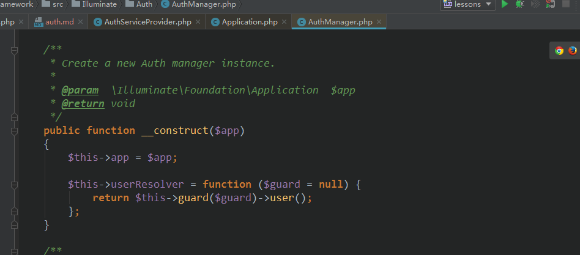
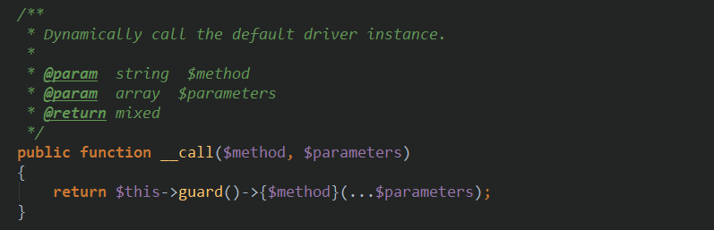
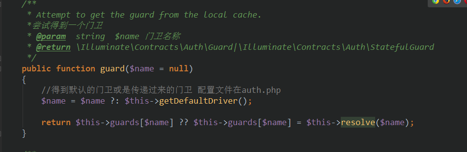
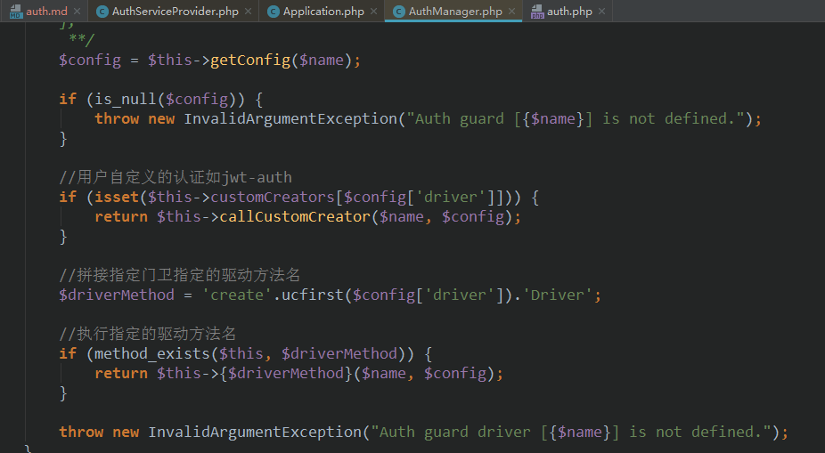

### Auth认证注解说明
- [auth用法文档](https://learnku.com/docs/laravel/5.5/authentication/1308)  
  
- auth()具体说明  
  auth()->attempt($credential);
  
  
  当使用auth()不传递参数时将使用默认的门卫配置选项，传递则使用用户选择的门卫配置   
  选项
  
  
  
  
  如果用户选择的门卫驱动是session则是返回  
  Illuminate\Auth\SessionGuard 实例