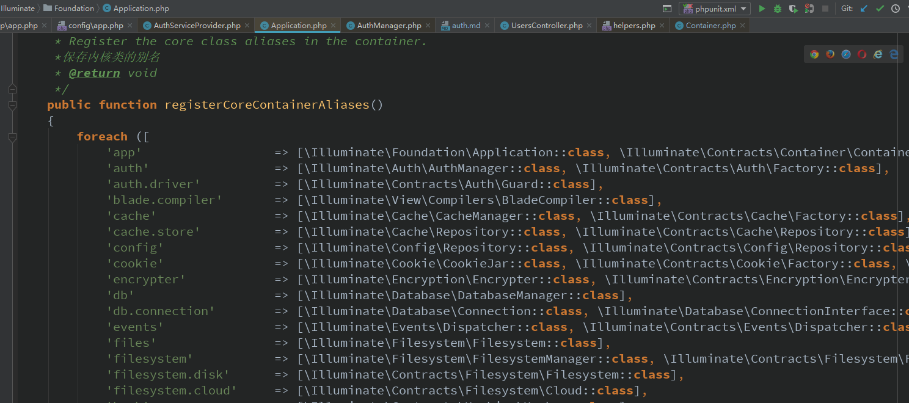
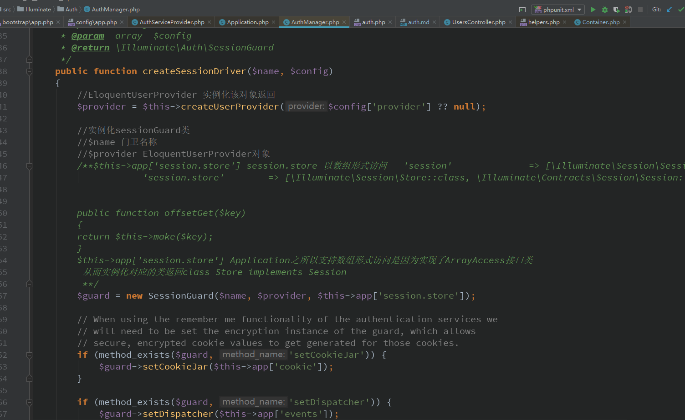

### Auth认证注解说明
- [auth用法文档](https://learnku.com/docs/laravel/5.5/authentication/1308)  
  
- auth   
 1、auth服务注册【他们叫注册同，其实就是保存auth=function()以key,value  
 形式保存在容器里的$this->bindings【auth】=function 里   
 
   
 
 2、auth()->xxx()引发的流程   
 
 
 app(AuthFactory::class)会得到类的别名auth  
 
 
 
 
 
   
 
 取回auth=function()返回一个匿名函数  
    
  返回的玩意是这下面的代码   
  ```php  
  function ($app) {
              // Once the authentication service has actually been requested by the developer
              // we will set a variable in the application indicating such. This helps us
              // know that we need to set any queued cookies in the after event later.
              $app['auth.loaded'] = true;
  
              return new AuthManager($app);
          }
  ```  
  就是刚才注册的玩意【框架在启动的时候，启动啥，就是HTTP发起请求的时候就是启动的时候  
  服务提供器【随便叫，反正都是PHP】会运行，会全部运行所有的服务提供类  
  所以AUTH才会得以保存在数组里【哦，专业点叫注册】   
  
  然后运行这个匿名函数，并传递容器=$app给这匿名函数   
     
  
  这样大家知道这auth()时取得的玩意了   
  `return app(AuthFactory::class)->guard($guard);`  由于guard  
  并未传递，所以呢运行如下   
     
  读取配置文件里的配置【auth.php】的配置   
  
  拼装驱动方法并运行指定的方法  
     
  
  默认的session驱动【后台保存就是这玩意】  
     
   
  准备创建相应的Model对象  
  
    
      
  
  session store 的说明   
  `$guard = new SessionGuard($name, $provider, $this->app['session.store']);`   
  
  session and session store 的注册  
     
  得到session的启动方式【默认是文件】   
    
  
  创建session驱动  
   
   
   
   
     
  
  至此返回的是SessionGuard  
     
  
  由此得到这auth要依赖于存储【文件，session,memcached，数据库等】  
  
  auth->attempt()登录操作   
   
  根据账号和密码查找记录【查询】  
    
  验证查找出来的数据【登录验证】  
      
  验证算法【 验证密码是否和散列值匹配】  
  
  用户在登录的过程中激活了一些事件【事件可以看本人前面写的注解】  
     
       
  
  auth->check()验证是否登录  
      
  
  至此OK 
  
  
  