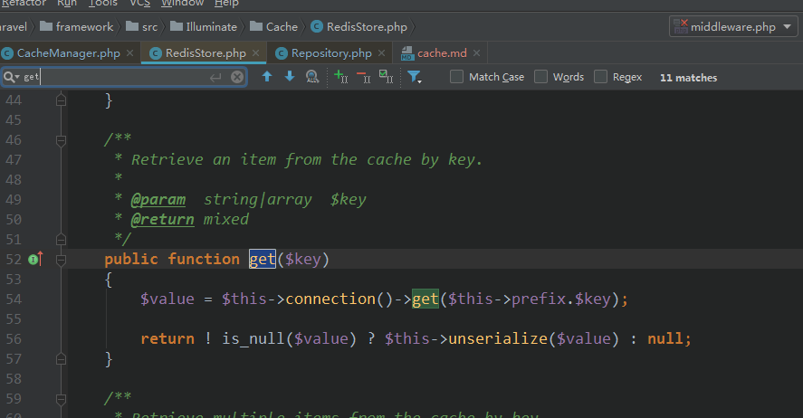

### cache  
- 缓存服务的注册  
    就是把cache=function(){缓存相关操作代码}保存在一个数组里   
      
    
    缓存的伪装类调用【伪装类如何实例化的请看前面说过的伪装器】  
      
    
    缓存管理器的结构  
      
    
    缓存保存的操作流程  
    Cache::put(xxx,'xxx');  
     
    
    得到缓存驱动【缓存类型】  
    
      
        
    
    假设默认【文件驱动类型的缓存】  
     
     
      
    
    最终返回  
       
    
    put(xxx,yyy)的骚操作  
      
    写入文件  
        
    
    从文件获取数据   
      
      
        
    
    以上是文件缓存的操作【分析保存和获取就够了，对文件的操作  
    的操作这么easy的问题没有必要都分析】  
    
    以下分析Redis的存取操作   
    获取Redis的驱动方法【反正这些骚玩意都是缓存管理器来管】  
    【用户的cache配置缓存类型决定要运行哪个方法】   
       
       
    
    put 使用redis的字符串操作方法  
       
    注意redis的连接是靠容器来处理的【套路都一样】  
    get 操作  
      
    
    下面是数据库的缓存【这个简单根本没有分析的价值了】  
    
    put操作  
      
    get操作  
        
    
    从此得出缓存【redis,file,mysql,等等】由缓存管理器来管理   
    根据配置选项来决定要用哪个  
    各个缓存的操作方法统一提供一样的接口    
    
    缓存系统的结构图  
    Illuminate\Cache\CacheManager->【根据缓存配置文件的配置选项】->createFileDriver   
    【文件，redis,database等】->Illuminate\Cache\Repository->Illuminate\Cache\  
    【FileStore\RedisStore\DatabaseStore】  
         
      
                           
                     
    