### console 应用注解说明
- 注册console kernel  
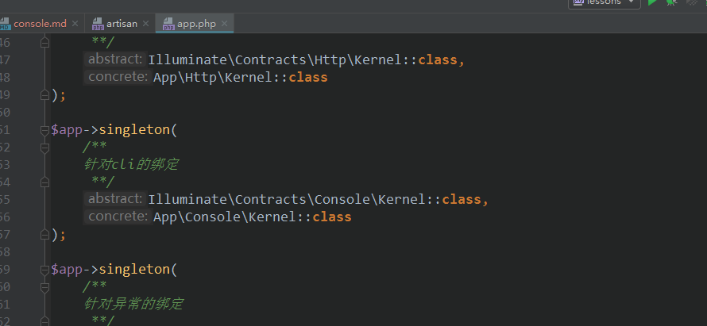  

- 从容器里检索并实例【反射】  
```php 
$kernel = $app->make(Illuminate\Contracts\Console\Kernel::class);
```  
实例后做如下动作  
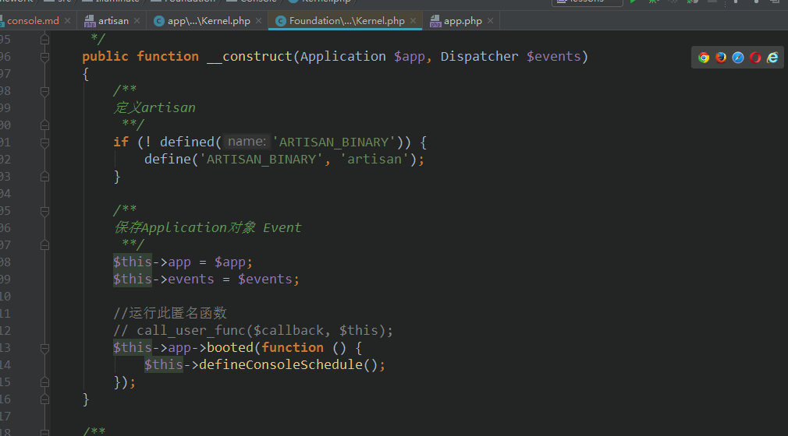  
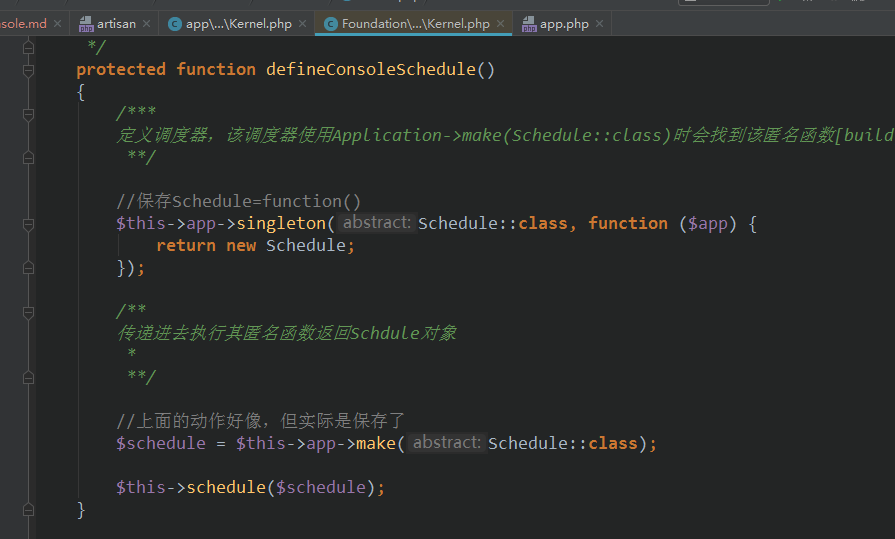  

- run handle  
 
  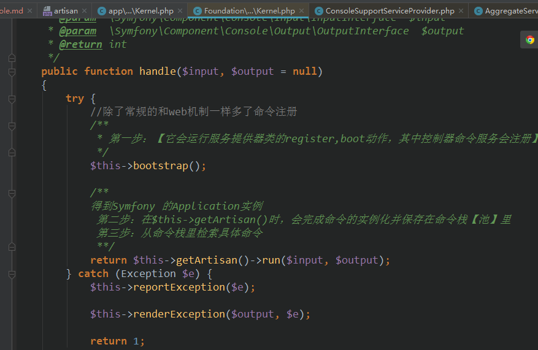  
  
  控制台命令注册加载   
   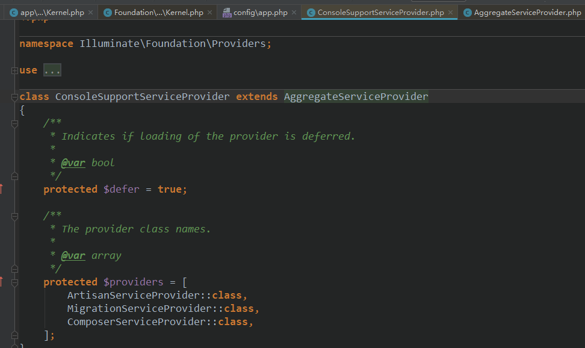 
   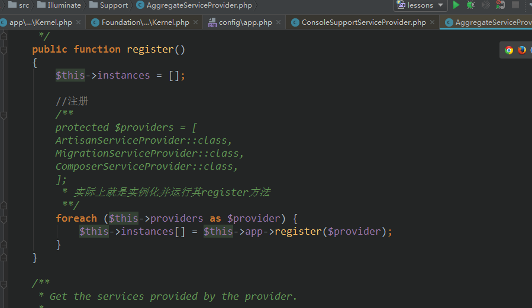 
   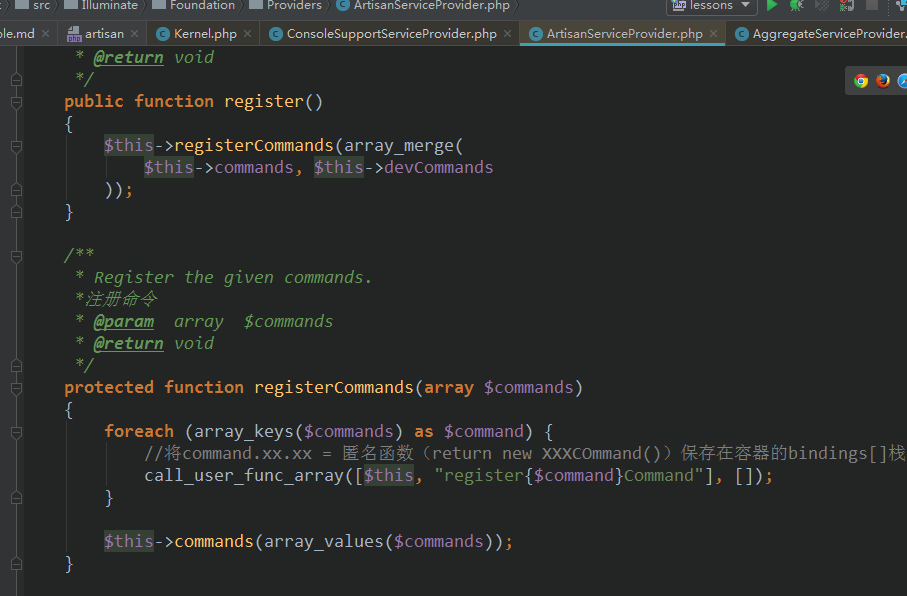 
   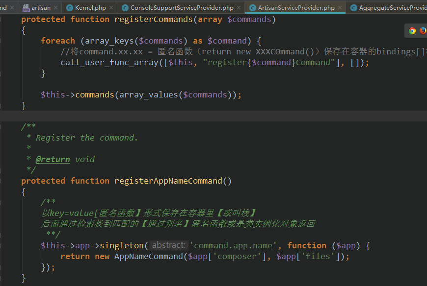 
   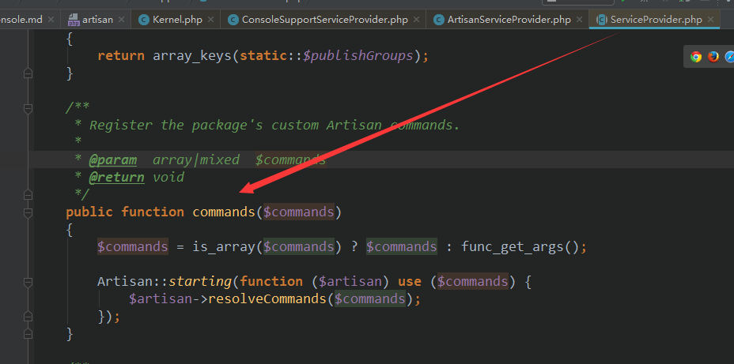 
   
  获取console Application 
  
   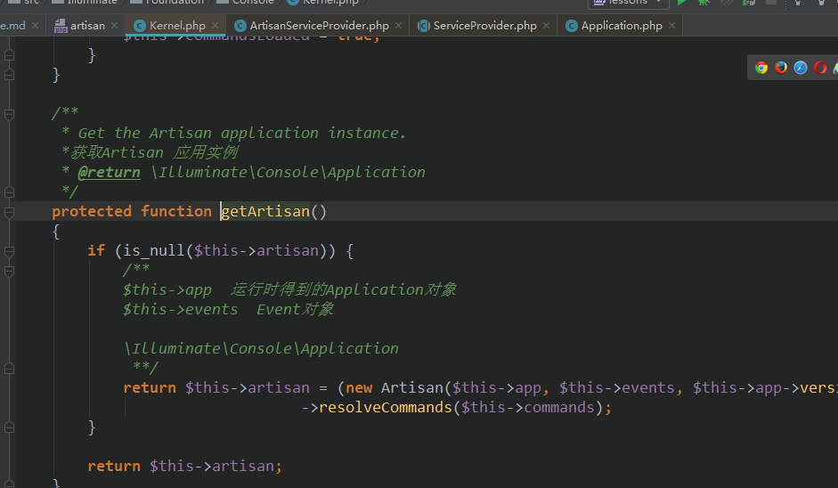  
   console Application 构造  
   ```php 
   public function __construct(Container $laravel, Dispatcher $events, $version)
       {
           parent::__construct('Laravel Framework', $version);
   
           /**
           laravel框架的容器
           事件调度器
            **/
           $this->laravel = $laravel;
           $this->events = $events;
           $this->setAutoExit(false);
           $this->setCatchExceptions(false);
   
           $this->events->dispatch(new Events\ArtisanStarting($this));
   
           /**
            * 这里在框架启动时【先运行服务提供器--  Illuminate\Foundation\Providers\ConsoleSupportServiceProvider::class】
            * 这会把命令名称，命名具体类以key,value形式保存在应用容器里的bindings[]栈里
            * function ($artisan) use ($commands) {
               $artisan->resolveCommands($commands);
             }
            * 然后此函数即 protected static $bootstrappers = [function ($artisan) use ($commands) {
           $artisan->resolveCommands($commands);
           }];
            * 便会循环检索栈里的具体命令类更实例化
            * 实例化完成之后，将命令名称，命令对象以key,value保存在Symfony\Component\Console->commands[$command->getName()] = $command;
            * 里
            * laravel是对console【symfony console】做了二次的封装处理，具体使用文档在
            * https://symfony.com/doc/current/components/console.html
            * require __DIR__.'/vendor/autoload.php';
   
              use Symfony\Component\Console\Application;
   
              $application = new Application();
   
               // ... register commands
   
              $application->run();
            */
           $this->bootstrap();
       }
   ```  
   命令实例化并添加  
    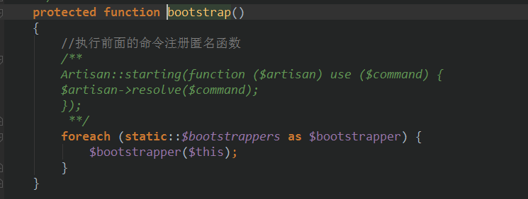 
    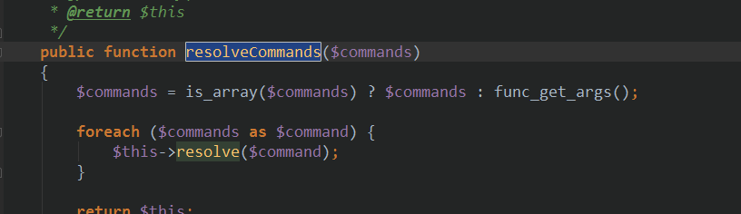 
    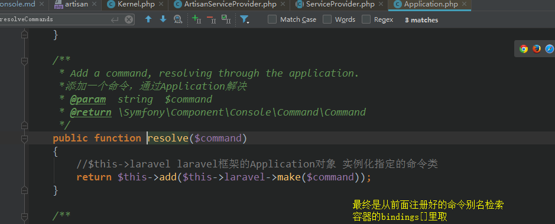 
    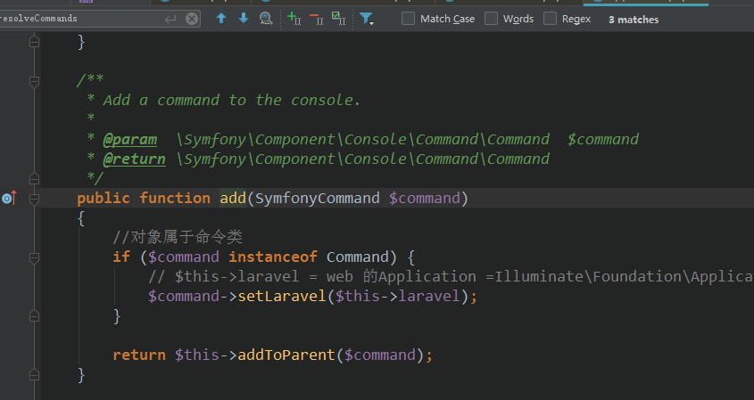 
    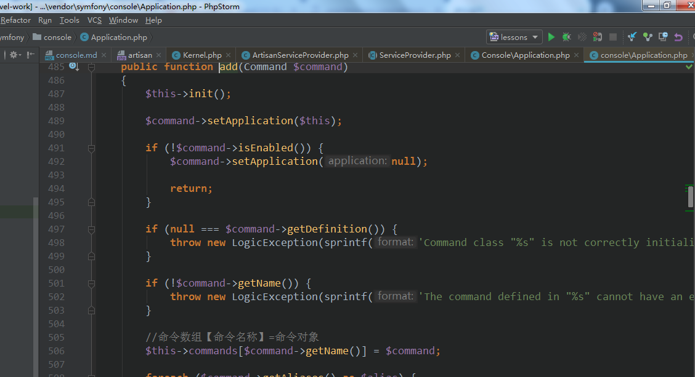 
    
    run command 运行命令   
    ```php 
     console Application
    public function run(InputInterface $input = null, OutputInterface $output = null)
        {
            /**
            获取命令名称 要么获取默认的命令，要么获取输入的命令参数
            假设键入的命令是php artisan route:list则该命令会返回route:list 否则返回默认的命名名称
             **/
            $commandName = $this->getCommandName(
                //输入对象  其实也就是 $argv参数的封装对象
                $input = $input ?: new ArgvInput
            );
    
            
            $this->events->fire(
                new Events\CommandStarting(
                    $commandName, $input, $output = $output ?: new ConsoleOutput
                )
            );
    
            //调度 具体文档在 https://symfony.com/doc/current/components/console.html
            //Syfmony/Console/Application->run()
            /**
            require __DIR__.'/vendor/autoload.php';
    
            use Symfony\Component\Console\Application;
    
            $application = new Application();
    
            // ... register commands
    
            $application->run();
             **/
            $exitCode = parent::run($input, $output);
    
            $this->events->fire(
                new Events\CommandFinished($commandName, $input, $output, $exitCode)
            );
    
            return $exitCode;
        }
    ```  
     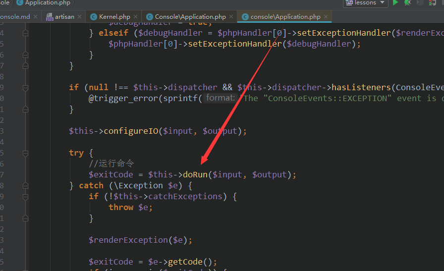 
     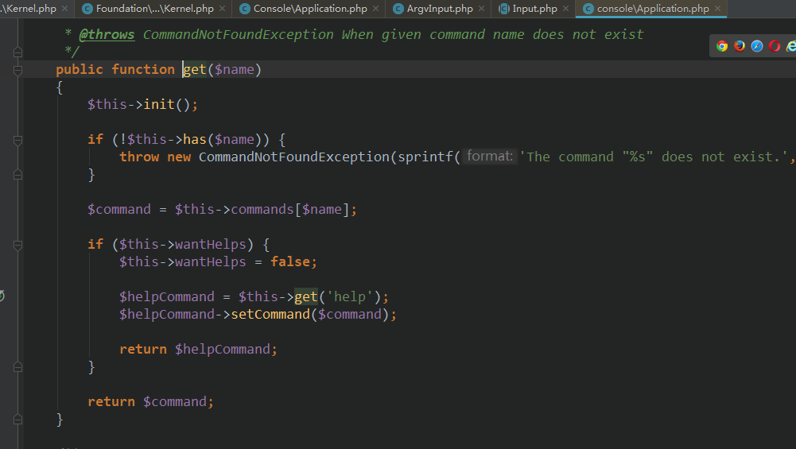 
     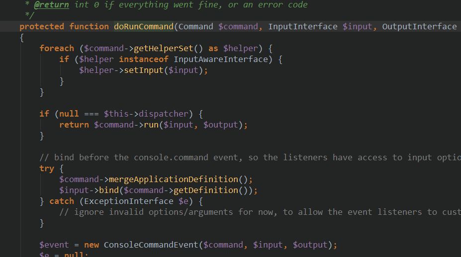 
     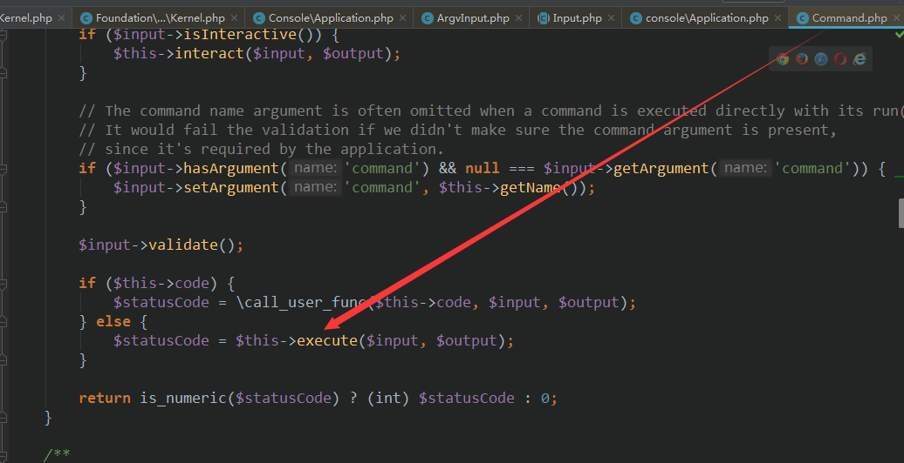 