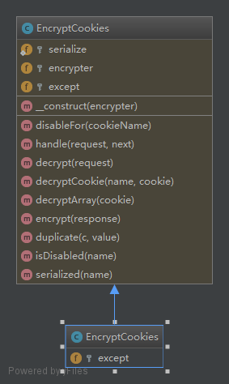
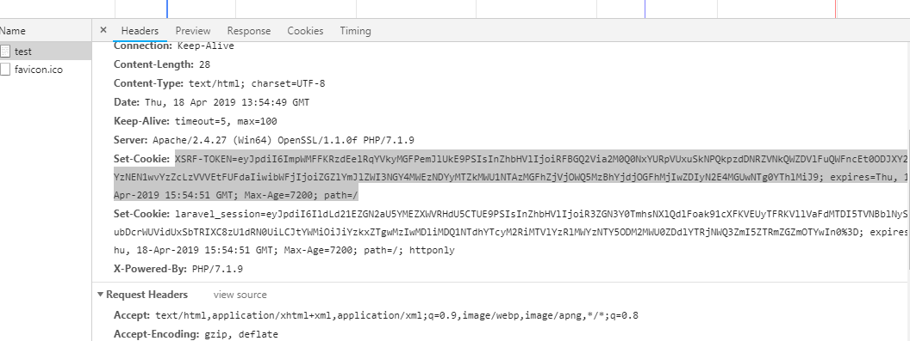
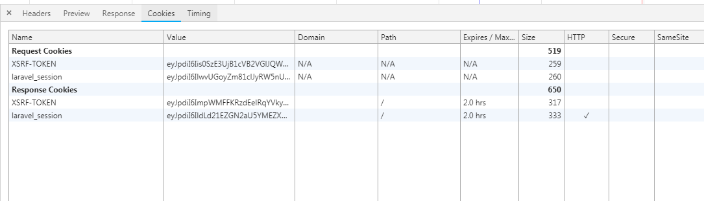
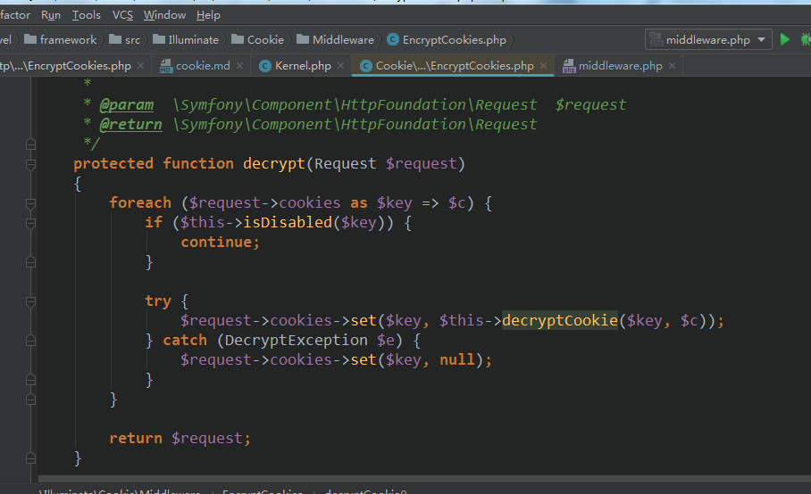

### cookie  
- cookie 中间件  
看看它的样子  
  

- [中间件类的运行原理测试源码](../test/middleware.php)  
运行结果
```php  
Closure Object
(
    [static] => Array
        (
            [stack] => Closure Object
                (
                    [static] => Array
                        (
                            [stack] => Closure Object
                                (
                                    [static] => Array
                                        (
                                            [callBack] => Closure Object
                                                (
                                                    [parameter] => Array
                                                        (
                                                            [$response] => <required>
                                                        )

                                                )

                                        )

                                    [this] => Pipe Object
                                        (
                                        )

                                    [parameter] => Array
                                        (
                                            [$response] => <required>
                                        )

                                )

                            [pipe] => verifyUserMiddleware
                        )

                    [this] => Pipe Object
                        (
                        )

                    [parameter] => Array
                        (
                            [$request] => <required>
                        )

                )

            [pipe] => verifyUserProfileMiddleware
        )

    [this] => Pipe Object
        (
        )

    [parameter] => Array
        (
            [$request] => <required>
        )

)
2
1
Array
(
    [name] => jack
    [age] => 18
)

```   
handler是层层嵌套的匿名函数，逐层执行匿名函数  
最外层的匿名先运行，再运行最外层的匿名函数时，它有2个参数，一个是匿名函数  
一个是parameter $request并且是必须传递的，我们发现，最外层的函数运行后  
它又发现了第二层匿名函数，同理逐层运行下去！！！  

- cookie 


 

- 解密cookie  
