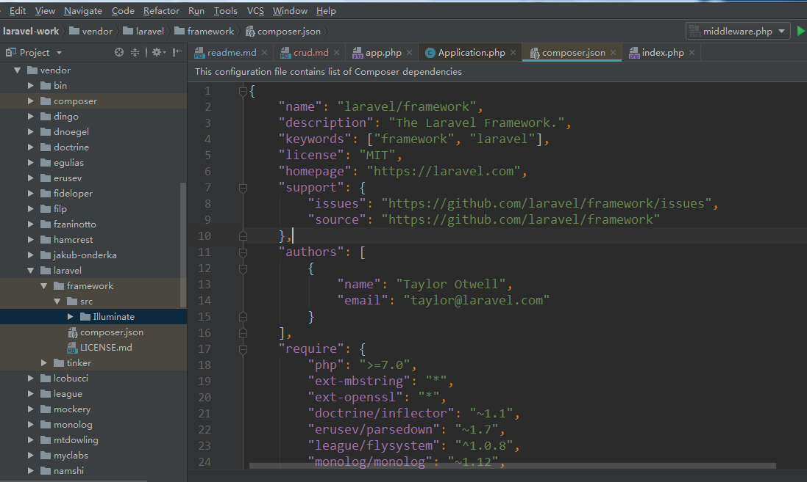
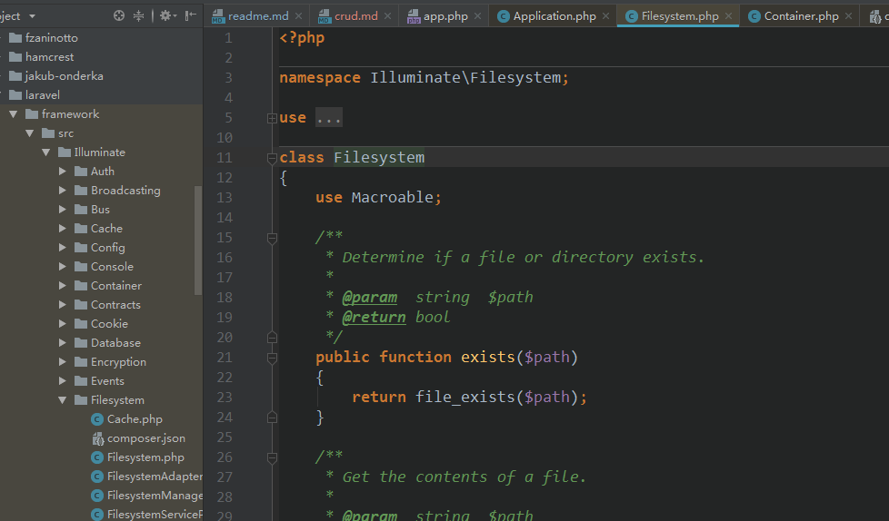
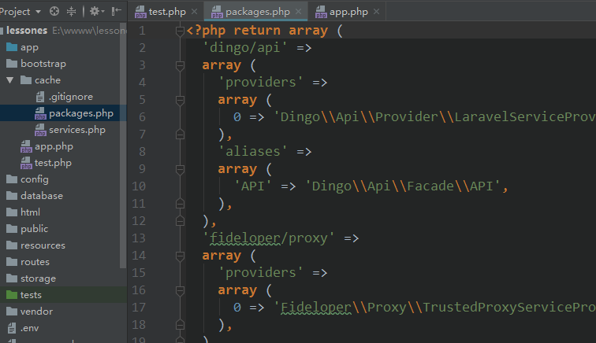
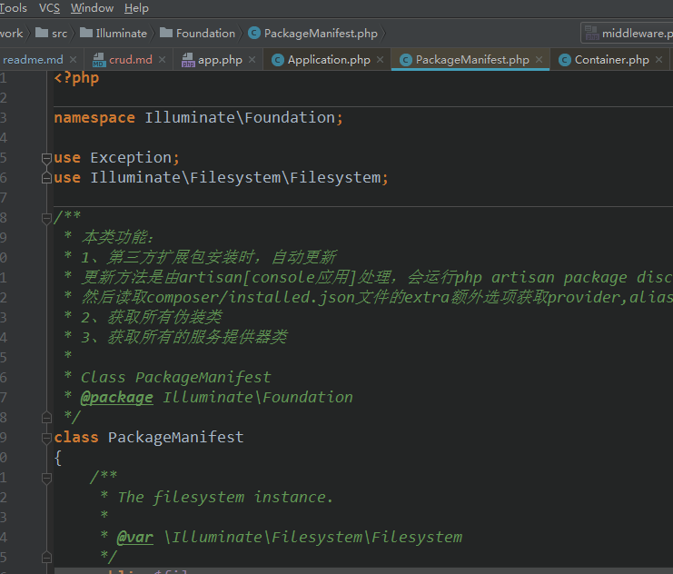
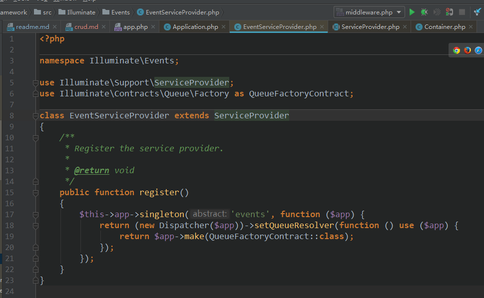
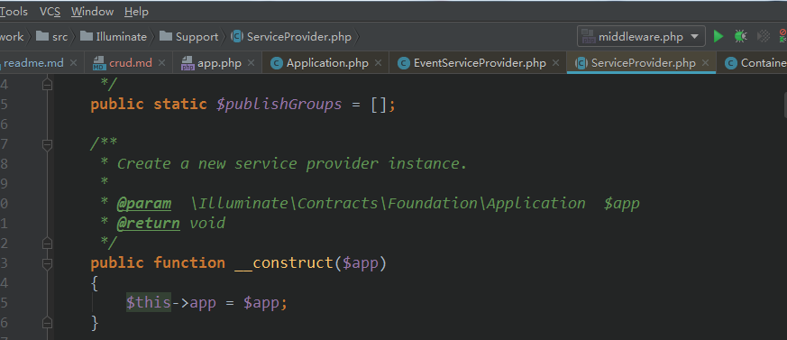
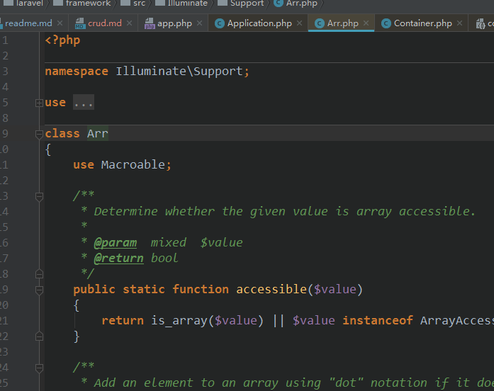

### crud  
- DB::xxx()用法的详细流程  
    - index.php入口文件开始  
    `require __DIR__.'/../vendor/autoload.php';`  
    没什么的，就是引入vendor目录下的自动加载文件，功能很明确就是解决整个框架类的自动加载  
    加载注册的函数，注册多个会构成队列【至于什么是队列，请自行看本方发布过的文章】  
    [队列结构](https://learnku.com/articles/30430)   
    composer的基本功能：加载第三方扩展包【git上的包大部分，也有其它的】和类的自动加载  
    vendor目录默认作为整个框架加载扩展包的目录，并且自动生成autoload.php文件用于自动加载  
    
    `$app = require_once __DIR__.'/../bootstrap/app.php';`   
    这个app.php文件会返回Application应用的实例，是个对象，现在我们进去看看它的代码   
    
    【bootstrap/app.php下的文件内容】
    ```php  
    $app = new Illuminate\Foundation\Application(
        realpath(__DIR__.'/../')
    );  
    
    这个是实例化一个类，Illuminate\Foundation是命名空间  
    其中Illuminate是根命名空间，Foundation是子命名空间，这个类名是 Application  
    这个文件是属于laravel/framework扩展包的内容，我们来看一下这个扩展包的composer.json   
    文件
 
    ```   
    laravel/framework包的信息   
       
    ```json   
    {
        "name": "laravel/framework",
        "description": "The Laravel Framework.",
        "keywords": ["framework", "laravel"],
        "license": "MIT",
        "homepage": "https://laravel.com",
        "support": {
            "issues": "https://github.com/laravel/framework/issues",
            "source": "https://github.com/laravel/framework"
        },
        "authors": [
            {
                "name": "Taylor Otwell",
                "email": "taylor@laravel.com"
            }
        ],
        "require": {
            "php": ">=7.0",
            "ext-mbstring": "*",
            "ext-openssl": "*",
            "doctrine/inflector": "~1.1",
            "erusev/parsedown": "~1.7",
            "league/flysystem": "^1.0.8",
            "monolog/monolog": "~1.12",
            "mtdowling/cron-expression": "~1.0",
            "nesbot/carbon": "^1.24.1",
            "psr/container": "~1.0",
            "psr/simple-cache": "^1.0",
            "ramsey/uuid": "~3.0",
            "swiftmailer/swiftmailer": "~6.0",
            "symfony/console": "~3.3",
            "symfony/debug": "~3.3",
            "symfony/finder": "~3.3",
            "symfony/http-foundation": "~3.3",
            "symfony/http-kernel": "~3.3",
            "symfony/process": "~3.3",
            "symfony/routing": "~3.3",
            "symfony/var-dumper": "~3.3",
            "tijsverkoyen/css-to-inline-styles": "~2.2",
            "vlucas/phpdotenv": "~2.2"
        },
        "replace": {
            "illuminate/auth": "self.version",
            "illuminate/broadcasting": "self.version",
            "illuminate/bus": "self.version",
            "illuminate/cache": "self.version",
            "illuminate/config": "self.version",
            "illuminate/console": "self.version",
            "illuminate/container": "self.version",
            "illuminate/contracts": "self.version",
            "illuminate/cookie": "self.version",
            "illuminate/database": "self.version",
            "illuminate/encryption": "self.version",
            "illuminate/events": "self.version",
            "illuminate/filesystem": "self.version",
            "illuminate/hashing": "self.version",
            "illuminate/http": "self.version",
            "illuminate/log": "self.version",
            "illuminate/mail": "self.version",
            "illuminate/notifications": "self.version",
            "illuminate/pagination": "self.version",
            "illuminate/pipeline": "self.version",
            "illuminate/queue": "self.version",
            "illuminate/redis": "self.version",
            "illuminate/routing": "self.version",
            "illuminate/session": "self.version",
            "illuminate/support": "self.version",
            "illuminate/translation": "self.version",
            "illuminate/validation": "self.version",
            "illuminate/view": "self.version",
            "tightenco/collect": "<5.5.33"
        },
        "require-dev": {
            "aws/aws-sdk-php": "~3.0",
            "doctrine/dbal": "~2.5",
            "filp/whoops": "^2.1.4",
            "mockery/mockery": "~1.0",
            "orchestra/testbench-core": "3.5.*",
            "pda/pheanstalk": "~3.0",
            "phpunit/phpunit": "~6.0",
            "predis/predis": "^1.1.1",
            "symfony/css-selector": "~3.3",
            "symfony/dom-crawler": "~3.3"
        },
        "autoload": {
            "files": [
                "src/Illuminate/Foundation/helpers.php",
                "src/Illuminate/Support/helpers.php"
            ],
            "psr-4": {
                "Illuminate\\": "src/Illuminate/"
            }
        },
        "autoload-dev": {
            "files": [
                "tests/Database/stubs/MigrationCreatorFakeMigration.php"
            ],
            "psr-4": {
                "Illuminate\\Tests\\": "tests/"
            }
        },
        "extra": {
            "branch-alias": {
                "dev-master": "5.5-dev"
            }
        },
        "suggest": {
            "ext-pcntl": "Required to use all features of the queue worker.",
            "ext-posix": "Required to use all features of the queue worker.",
            "aws/aws-sdk-php": "Required to use the SQS queue driver and SES mail driver (~3.0).",
            "doctrine/dbal": "Required to rename columns and drop SQLite columns (~2.5).",
            "fzaninotto/faker": "Required to use the eloquent factory builder (~1.4).",
            "guzzlehttp/guzzle": "Required to use the Mailgun and Mandrill mail drivers and the ping methods on schedules (~6.0).",
            "laravel/tinker": "Required to use the tinker console command (~1.0).",
            "league/flysystem-aws-s3-v3": "Required to use the Flysystem S3 driver (~1.0).",
            "league/flysystem-rackspace": "Required to use the Flysystem Rackspace driver (~1.0).",
            "league/flysystem-cached-adapter": "Required to use Flysystem caching (~1.0).",
            "nexmo/client": "Required to use the Nexmo transport (~1.0).",
            "pda/pheanstalk": "Required to use the beanstalk queue driver (~3.0).",
            "predis/predis": "Required to use the redis cache and queue drivers (~1.0).",
            "pusher/pusher-php-server": "Required to use the Pusher broadcast driver (~3.0).",
            "symfony/css-selector": "Required to use some of the crawler integration testing tools (~3.3).",
            "symfony/dom-crawler": "Required to use most of the crawler integration testing tools (~3.3).",
            "symfony/psr-http-message-bridge": "Required to psr7 bridging features (~1.0)."
        },
        "config": {
            "sort-packages": true
        },
        "minimum-stability": "dev",
        "prefer-stable": true
    }

    ```   
    我们看到这个包依赖的第三方包还特别多的，symfony包也有不少，我们只关注这个包的  
    类是怎么加载的就行了。  
    ```php "autoload": {
             "files": [
                 "src/Illuminate/Foundation/helpers.php",
                 "src/Illuminate/Support/helpers.php"
             ],
             "psr-4": {
                 "Illuminate\\": "src/Illuminate/"
             }
         },```   
    这个是一个自动加载的选项配置，它的主要作用是在框架在使用本扩展包，会自动加载  
    根命名空间对应的根目录，这就是我们所说的psr-4，本扩展包的类根命名空间都是 
    Illuminate\\，如果还有子目录，就会对应子命名空间，再对具体的类文件名，当然按标准   
    之后，类名对应类文件名了，同时在使得本扩展包的相关函数时，也会自动引入files  
    选项下的文件，为什么会自动加载【麻烦你看看php手册，composer手册吧】  
    
    下面我们来看这个Application的命名空间是不是这个composer.json文件指定的  
     ```php  
     namespace Illuminate\Foundation;
     
     use Closure;
     use RuntimeException;
     use Illuminate\Support\Arr;
     use Illuminate\Support\Str;
     use Illuminate\Http\Request;
     use Illuminate\Support\Collection;
     use Illuminate\Container\Container;
     use Illuminate\Filesystem\Filesystem;
     use Illuminate\Log\LogServiceProvider;
     use Illuminate\Support\ServiceProvider;
     use Illuminate\Events\EventServiceProvider;
     use Illuminate\Routing\RoutingServiceProvider;
     use Symfony\Component\HttpKernel\HttpKernelInterface;
     use Symfony\Component\HttpKernel\Exception\HttpException;
     use Illuminate\Contracts\Http\Kernel as HttpKernelContract;
     use Illuminate\Foundation\Bootstrap\LoadEnvironmentVariables;
     use Symfony\Component\HttpFoundation\Request as SymfonyRequest;
     use Symfony\Component\HttpKernel\Exception\NotFoundHttpException;
     use Illuminate\Contracts\Foundation\Application as ApplicationContract;
     
     class Application extends Container implements ApplicationContract, HttpKernelInterface
     ```  
     
     所以实例化Illuminate\Foundation\Application时它会自动引下  
     vendor/laravel/framework/src/Illuminate/Foundation/Application.php   
     这个类文件，这个类文件有2个基类，是Container，ApplicationContract, HttpKernelInterface
     implements后面是接口类，接口类嘛就是规范子类的方法，告诉子类继承时你必须实现我指定的方法   
     extends嘛就是说子类可以拥有基类的成员，可访问，父类也可以访问子类的成员，他们2者构成Application  
     的整体功能。 
     
     实例化Application时必然会运行它的构造函数了，所以我们来看它的构造函数   
     
     【vendor/laravel/framework/src/Illuminate/Foundation/Application.php的构造函数内容】  
     ```php  
    public function __construct($basePath = null)
        {
            if ($basePath) {
                $this->setBasePath($basePath);
            }
            $this->registerBaseBindings();
            $this->registerBaseServiceProviders();
            $this->registerCoreContainerAliases();
        } 
     ```        
     第一句代码就是判断，判断有没有给根路径，显然给了`realpath(__DIR__.'/../')` 
     这是这个项目的根绝对路径,然后我们进入该方法看看它干什么了  
     ```php  
     public function setBasePath($basePath)
         {
         
            //过滤左边的特殊字符得到路径
             $this->basePath = rtrim($basePath, '\/');
     
             $this->bindPathsInContainer();
     
             return $this;
         }
     ```                 
     我们再继续进去，看看它是怎么把框架的路径信息绑定在容器里的   
     ```php  
     protected function bindPathsInContainer()
         {
         //return $this->basePath.DIRECTORY_SEPARATOR.'app'.($path ? DIRECTORY_SEPARATOR.$path : $path);
         //拼装/app/路径返回 app是应用路径，就是框架/app目录
             $this->instance('path', $this->path());
             //返回根路径
             $this->instance('path.base', $this->basePath());
             //返回return $this->basePath.DIRECTORY_SEPARATOR.'resources'.($path ? DIRECTORY_SEPARATOR.$path : $path);
             //再拼装return $this->resourcePath().DIRECTORY_SEPARATOR.'lang';
             //返回/resources/lang目录
             $this->instance('path.lang', $this->langPath());
             //返回$this->basePath.DIRECTORY_SEPARATOR.'config'.($path ? DIRECTORY_SEPARATOR.$path : $path);
             //就是config目录
             $this->instance('path.config', $this->configPath());
             //返回return $this->basePath.DIRECTORY_SEPARATOR.'public';
             //就是public目录
             $this->instance('path.public', $this->publicPath());
             //返回return $this->storagePath ?: $this->basePath.DIRECTORY_SEPARATOR.'storage';
             //就是storage目录
             $this->instance('path.storage', $this->storagePath());
             //return ($this->databasePath ?: $this->basePath.DIRECTORY_SEPARATOR.'database').($path ? DIRECTORY_SEPARATOR.$path : $path);
             //database目录
             $this->instance('path.database', $this->databasePath());
             //return $this->basePath.DIRECTORY_SEPARATOR.'resources'.($path ? DIRECTORY_SEPARATOR.$path : $path);
             //resources资源目录
             $this->instance('path.resources', $this->resourcePath());
             //返回 return $this->basePath.DIRECTORY_SEPARATOR.'bootstrap'.($path ? DIRECTORY_SEPARATOR.$path : $path);
             //bootstrap目录 
             $this->instance('path.bootstrap', $this->bootstrapPath());
         }
     ```     
     下面我们来看instance是做什么的【看看这个工人是干什么活的】 
     ```php   
     public function instance($abstract, $instance)
         {
         //这句代码我们现在不看，刚实例化关这吊毛什么事啊
         //是不是
             $this->removeAbstractAlias($abstract);
     
        /***
        return isset($this->bindings[$abstract]) ||
                       isset($this->instances[$abstract]) ||
                       $this->isAlias($abstract);
                       return isset($this->aliases[$name]);
        ***/
        //就是判断在bindings,instances,aliases数组是否有指定的key
        //很显然暂时没有什么用
             $isBound = $this->bound($abstract);
     
     //这句在这里也没有什么鬼用
             unset($this->aliases[$abstract]);
     
             // We'll check to determine if this type has been bound before, and if it has
             // we will fire the rebound callbacks registered with the container and it
             // can be updated with consuming classes that have gotten resolved here.
             
             //哦，这句有用了，就是把app,bootstrap,config,database,public,resources
             //storage保存在这个数组里，保存在这个数组里干嘛，目前不知道
             //可能是作者瞎写着玩的，以为好玩
             $this->instances[$abstract] = $instance;
     
     //这句也没有什么用了，目前 
             if ($isBound) {
                 $this->rebound($abstract);
             }
     
             return $instance;
         }
     ```  
     至此`$this->setBasePath($basePath);`这句代码所引发的连环流程完成的功能就是将  
     框架各个目录路径保存起来，保存起来干什么啊？我不知道，可能作者觉得无聊或是好玩吧  
     毕竟大佬我们看不懂  
     接着我们继续分析代码  
     ` $this->registerBaseBindings();`   
     我们进去它是干什么飞机的，```php   
     protected function registerBaseBindings()
         {
         /**
         return static::$instance = $container;
         把自己保存在instance上，好玩吗？这样^_^
         
         **/
             static::setInstance($this);
     
              //这个函数，刚才我们分析过了哦
              //就是把app=$this保存在
              //instances[app]=$this，好玩吗
             $this->instance('app', $this);
     
              //同样的道理，存储在数组里
              
             $this->instance(Container::class, $this);
     
            //同样的道理，存起来，怕它们飞了
             $this->instance(PackageManifest::class, new PackageManifest(
                 new Filesystem, $this->basePath(), $this->getCachedPackagesPath()
             ));
             //这PackageManifest接受了3个参数，我们一一的来看这3个参数  
             //
         }
     ``   
     `new Filesystem`看看这吊毛干什么用的   
     我们先看它的composer.json文件，它是引用其它扩展包的  
       
     【composer.json文件内容】  
     ```json  
     {
         "name": "illuminate/filesystem",//包类，没啥可说的
         "description": "The Illuminate Filesystem package.",
         "license": "MIT",
         "homepage": "https://laravel.com",
         "support": {
             "issues": "https://github.com/laravel/framework/issues",
             "source": "https://github.com/laravel/framework"
         },
         "authors": [
             {
                 "name": "Taylor Otwell",//对，就是这大佬撸的包
                 "email": "taylor@laravel.com"
             }
         ],
         "require": {
             "php": ">=7.0",
             "illuminate/contracts": "5.5.*",
             "illuminate/support": "5.5.*",
             "symfony/finder": "~3.3"//哦，还依赖了symfony的包
         },
         "autoload": {
             "psr-4": {
                 "Illuminate\\Filesystem\\": ""//该包下所有的类
                 //根命名空间对应的路径就是当前路径
             }
         },
         "extra": {
         //分支别名，干嘛用的啊
         //https://docs.phpcomposer.com/articles/aliases.html
         //手册路径放这里了哦，不要问了，再问就要打人了哦
             "branch-alias": {
                 "dev-master": "5.5-dev"
             }
         },
         "suggest": {
             "league/flysystem": "Required to use the Flysystem local and FTP drivers (~1.0).",
             "league/flysystem-aws-s3-v3": "Required to use the Flysystem S3 driver (~1.0).",
             "league/flysystem-rackspace": "Required to use the Flysystem Rackspace driver (~1.0)."
         },
         "config": {
             "sort-packages": true
         },
         "minimum-stability": "dev"
     }

     ```  
     下面我们来看这个Filesystem.php文件吧，看看这吊毛是做什么的   
     ```php   
     namespace Illuminate\Filesystem;
     //Illuminate\Filesystem 对应的路径是vendor/laravel/framework/src
     //Illuminate/Filesystem/Filesystem.php  
     
     
     use ErrorException;
     use FilesystemIterator;
     use Symfony\Component\Finder\Finder;
     use Illuminate\Support\Traits\Macroable;
     use Illuminate\Contracts\Filesystem\FileNotFoundException;
     
     //就一个类名
     class Filesystem
     {
     //PHP宏扩展【干什么用的啊，看看手册或是本人前面写过的】
         use Macroable;
     
         /**
          * Determine if a file or directory exists.
          *
          * @param  string  $path
          * @return bool
          */
         public function exists($path)
         {
             return file_exists($path);
         }
     ```  
     读读源码就知道了，用于对文件，目录进行操作的   
     第二个参数`$this->basePath()`不用解释了吧，获取根路径   
     第三个参数得到的是`return $this->bootstrapPath().'/cache/packages.php';`   
     就是bootstrap/cache/packages.php文件，其实这文件返回的是一个数组   
     返回的样子长这样  
       
     就是aliases,providers的一个数组，干嘛用的啊，我们继续分析，后面肯定知道这吊毛是做什么的嘛   
     
     接下来我们看看这吊毛`PackageManifest`长啥样   
       
     哦长这样，看看它的构造函数，构造函数肯定会运行的，所以我们看看  
     【Illuminate\Foundation\PackageManifest文件的构造函数】
     ```php  
     public function __construct(Filesystem $files, $basePath, $manifestPath)
         {
         //哦，这吊毛存储的是Filesystem类的实例
             $this->files = $files;
             //这个保存的是框架的根路径
             $this->basePath = $basePath;
             //  return $this->bootstrapPath().'/cache/packages.php';
             //这个就是保存bootstrap/cache/packages.php
             $this->manifestPath = $manifestPath;
             //这个是composer的vendor目录路径
             $this->vendorPath = $basePath.'/vendor';
         }
     ```   
     
     至此`registerBaseBindings()`的功能就是将app,Container::class,PackageManifest::class  
     对应的内容保存在instances数组里，好玩吗？  
     
     下面继续分析`$this->registerBaseServiceProviders()`  
     呐，它的内容如下  
     ```php  
     protected function registerBaseServiceProviders()
         {
             $this->register(new EventServiceProvider($this));
             $this->register(new LogServiceProvider($this));
             $this->register(new RoutingServiceProvider($this));
         }
     ```  
     来，分析这吊毛`new EventServiceProvider($this)`  
       
     它继承了基类ServiceProvider服务提供者，基类的构造函数肯定接受参数了嘛   
       这就是它的功能，下面继续分析  
     `$this->register(xxx)`  看看这家伙又是什么的  
     【register方法内容】  
     ```php  
     public function register($provider, $options = [], $force = false)
         {
             if (($registered = $this->getProvider($provider)) && ! $force) {
                 return $registered;
             }
     
             if (is_string($provider)) {
                 
                 $provider = $this->resolveProvider($provider);
             }
     
           
             if (method_exists($provider, 'register')) {
                 $provider->register();
             }
     
        
             $this->markAsRegistered($provider);
     
             if ($this->booted) {
                 $this->bootProvider($provider);
             }
     
             return $provider;
         }  
         
     ```   
     先分析这句话`$this->getProvider($provider))`        
     
     ```php 
     
           public function getProvider($provider)
          {
              return array_values($this->getProviders($provider))[0] ?? null;
          }
          
     ```  
     
     下面接着看`$this->getProvider($provider))` 看看它是做什么的  
     ```php  
     public function getProvider($provider)
         {
             return array_values($this->getProviders($provider))[0] ?? null;
         }
     ```  
     没错，返回了一个数组，关键是框架刚启动【http请求时就启动】，这个破数组能有什么什么东西啊  
     不过，我们继续看 
     ```php  
     public function getProviders($provider)
         {
             //根据传递的参数，取得指定参数对应的value返回
             $name = is_string($provider) ? $provider : get_class($provider);
     
             return Arr::where($this->serviceProviders, function ($value) use ($name) {
             //返回$value属于$name,这个name就是$provider的类名
                 return $value instanceof $name;
             });
         }
     ```  
     ```php  
     //就一个空数组，你处理毛线啊【目前没有用】
     protected $serviceProviders = [];
     ```  
     下面我们来看这个Arr这个吊东西  
       
     这是它大概的模样，下面看看它的where是干什么用的啊  
     ```php  
      public static function where($array, callable $callback)
         {
             return array_filter($array, $callback, ARRAY_FILTER_USE_BOTH);
         }
     ```  
     呐，用了这个破数组，这个数组是干嘛用的啊，我们去看手册  
     [array_filter手册](https://www.php.net/manual/zh/function.array-filter.php)  
     
     所以这个函数where就是用于从数组查找指定的内容，框架刚启动，这serviceProviders是空的  
     `if (($registered = $this->getProvider($provider)) && ! $force) {
                       return $registered;
                   }
           `  
     所以这句话目前没有什么吊用，我们继续向下看吧  
     `if (is_string($provider)) {
                       
                       $provider = $this->resolveProvider($provider);
                   }`  
     这句也不有什么用，它又不是字符串，是个对象啊  
     ` if (method_exists($provider, 'register')) {
                  $provider->register();
              }`   
              
     这句话有用了，判断这个对象是否存在指定的方法，我们去看它的方法  
     ```php  
     class EventServiceProvider extends ServiceProvider
     {
         /**
          * Register the service provider.
          *
          * @return void
          */
         public function register()
         {
             $this->app->singleton('events', function ($app) {
                 return (new Dispatcher($app))->setQueueResolver(function () use ($app) {
                     return $app->make(QueueFactoryContract::class);
                 });
             });
         }
     }
     ```  
     我们看到它app调用了singleton方法了，这就是刚才实例化就是`new EventServiceProvider($this)`  
     传递$this的原因啦，不然它调用啥  
     我们来看看singleton方法  
     ```php  
       public function singleton($abstract, $concrete = null)
         {
             $this->bind($abstract, $concrete, true);
         }
     ```  
     再来看bind方法  
     ```php  
     public function bind($abstract, $concrete = null, $shared = false)
         {
         /**
         protected function dropStaleInstances($abstract)
             {
                 unset($this->instances[$abstract], $this->aliases[$abstract]);
             }
             判断instances,aliases是否保存了
         **/
             $this->dropStaleInstances($abstract);
             if (is_null($concrete)) {
                 $concrete = $abstract;
             }
             //如果不是匿名函数类，很显然这句话我们不用看
             if (! $concrete instanceof Closure) {
                 $concrete = $this->getClosure($abstract, $concrete);
             }
             //compact把，concrete,shared构造成一个数组
             $this->bindings[$abstract] = compact('concrete', 'shared');
             /**
             /**
                     return isset($this->aliases[$name]);
                     取回类名的别名
                      **/
                     if ($this->isAlias($abstract)) {
                         //取回类的别名
                         $abstract = $this->getAlias($abstract);
                     }
             
                     return isset($this->resolved[$abstract]) ||
                            isset($this->instances[$abstract]);
             **/
             //很明显我们不用管这句话是干什么的
             if ($this->resolved($abstract)) {
                 $this->rebound($abstract);
             }
         }
     ```  
     ` $this->register(new EventServiceProvider($this));`  这句话是做什么的啊  
     就是运行EventServiceProvider->register方法  
     注册就是别名，匿名函数保存在bindings数组里  
     
     接着看`new LogServiceProvider($this)`  
     ```php  
     public function register()
         {
             $this->app->singleton('log', function () {
                 return $this->createLogger();
             });
         } 
     ```  
     
     接着看路由的服务注册  
     ```php  
     $this->register(new RoutingServiceProvider($this));  
     public function register()
         {
             /**
             将router= function(){return Router($app['events'], $app);} key,value键值
             形式保存在Application->bindings[]里
              **/
             $this->registerRouter();
             // $this->app->singleton('router', function ($app) {
                           return new Router($app['events'], $app);
                       });
                       
                       
     
             $this->registerUrlGenerator();
     
             $this->registerRedirector();
     
             $this->registerPsrRequest();
     
             $this->registerPsrResponse();
     
             $this->registerResponseFactory();
     
             $this->registerControllerDispatcher();
         }
     ```    
     
     好了，我们再来看最后一句`$this->registerCoreContainerAliases();`  
     ```php  
     public function registerCoreContainerAliases()
         {
             foreach ([
                 'app'                  => [\Illuminate\Foundation\Application::class, \Illuminate\Contracts\Container\Container::class, \Illuminate\Contracts\Foundation\Application::class,  \Psr\Container\ContainerInterface::class],
                 'auth'                 => [\Illuminate\Auth\AuthManager::class, \Illuminate\Contracts\Auth\Factory::class],
                 'auth.driver'          => [\Illuminate\Contracts\Auth\Guard::class],
                 'blade.compiler'       => [\Illuminate\View\Compilers\BladeCompiler::class],
                 'cache'                => [\Illuminate\Cache\CacheManager::class, \Illuminate\Contracts\Cache\Factory::class],
                 'cache.store'          => [\Illuminate\Cache\Repository::class, \Illuminate\Contracts\Cache\Repository::class],
                 'config'               => [\Illuminate\Config\Repository::class, \Illuminate\Contracts\Config\Repository::class],
                 'cookie'               => [\Illuminate\Cookie\CookieJar::class, \Illuminate\Contracts\Cookie\Factory::class, \Illuminate\Contracts\Cookie\QueueingFactory::class],
                 'encrypter'            => [\Illuminate\Encryption\Encrypter::class, \Illuminate\Contracts\Encryption\Encrypter::class],
                 'db'                   => [\Illuminate\Database\DatabaseManager::class],
                 'db.connection'        => [\Illuminate\Database\Connection::class, \Illuminate\Database\ConnectionInterface::class],
                 'events'               => [\Illuminate\Events\Dispatcher::class, \Illuminate\Contracts\Events\Dispatcher::class],
                 'files'                => [\Illuminate\Filesystem\Filesystem::class],
                 'filesystem'           => [\Illuminate\Filesystem\FilesystemManager::class, \Illuminate\Contracts\Filesystem\Factory::class],
                 'filesystem.disk'      => [\Illuminate\Contracts\Filesystem\Filesystem::class],
                 'filesystem.cloud'     => [\Illuminate\Contracts\Filesystem\Cloud::class],
                 'hash'                 => [\Illuminate\Contracts\Hashing\Hasher::class],
                 'translator'           => [\Illuminate\Translation\Translator::class, \Illuminate\Contracts\Translation\Translator::class],
                 'log'                  => [\Illuminate\Log\Writer::class, \Illuminate\Contracts\Logging\Log::class, \Psr\Log\LoggerInterface::class],
                 'mailer'               => [\Illuminate\Mail\Mailer::class, \Illuminate\Contracts\Mail\Mailer::class, \Illuminate\Contracts\Mail\MailQueue::class],
                 'auth.password'        => [\Illuminate\Auth\Passwords\PasswordBrokerManager::class, \Illuminate\Contracts\Auth\PasswordBrokerFactory::class],
                 'auth.password.broker' => [\Illuminate\Auth\Passwords\PasswordBroker::class, \Illuminate\Contracts\Auth\PasswordBroker::class],
                 'queue'                => [\Illuminate\Queue\QueueManager::class, \Illuminate\Contracts\Queue\Factory::class, \Illuminate\Contracts\Queue\Monitor::class],
                 'queue.connection'     => [\Illuminate\Contracts\Queue\Queue::class],
                 'queue.failer'         => [\Illuminate\Queue\Failed\FailedJobProviderInterface::class],
                 'redirect'             => [\Illuminate\Routing\Redirector::class],
                 'redis'                => [\Illuminate\Redis\RedisManager::class, \Illuminate\Contracts\Redis\Factory::class],
                 'request'              => [\Illuminate\Http\Request::class, \Symfony\Component\HttpFoundation\Request::class],
                 'router'               => [\Illuminate\Routing\Router::class, \Illuminate\Contracts\Routing\Registrar::class, \Illuminate\Contracts\Routing\BindingRegistrar::class],
                 'session'              => [\Illuminate\Session\SessionManager::class],
                 'session.store'        => [\Illuminate\Session\Store::class, \Illuminate\Contracts\Session\Session::class],
                 'url'                  => [\Illuminate\Routing\UrlGenerator::class, \Illuminate\Contracts\Routing\UrlGenerator::class],
                 'validator'            => [\Illuminate\Validation\Factory::class, \Illuminate\Contracts\Validation\Factory::class],
                 'view'                 => [\Illuminate\View\Factory::class, \Illuminate\Contracts\View\Factory::class],
             ] as $key => $aliases) {
                 foreach ($aliases as $alias) {
                     //别名  类名
                     $this->alias($key, $alias);
                     /**
                      //类名=别名
                             $this->aliases[$alias] = $abstract;
                             //aliases[\Illuminate\Foundation\Application::class]=app
                             //aliases[ \Psr\Container\ContainerInterface::class]=app
                             //aliases[\Illuminate\Contracts\Foundation\Application::class]=app
                             //aliases[\Illuminate\Contracts\Container\Container::class]=app
                             
                             //以此方式存储起来
                             //别名[]=类名
                             
                             //abstractAliases[app][]=\Illuminate\Foundation\Application::class
                             //abstractAliases[app][]= \Psr\Container\ContainerInterface::class
                             //abstractAliases[app][]=\Illuminate\Contracts\Foundation\Application::class
                             //abstractAliases[app][]=\Illuminate\Contracts\Container\Container::class
                             $this->abstractAliases[$abstract][] = $alias;
                     **/
                 }
             }
             
             $this->aliases;
             $this->abstractAliases;
         }

     ```  
     
    ===============================================================================================  
    
    经过层层分析，实例化Application完成了如下动作  
    1、框架各个目录保存，以及app，Container::class，PackageManifest::class保存在
    instances【】数组里 
    2、运行EventServiceProvider,LogServiceProvider,RoutingServiceProvider的register 
    方法并将对应的服务注册【就是保存在bindings数组里】
    3、将框架的核心类以别名[]=类名，类名=别名形式保存在aliases,abstractAliases里  
    
    经过上面的流程后，再返回$app哦  
    
    接着看app.php文件的下一句代码  
    `$app->singleton(
         /**
         针对web的绑定
     
          **/
         Illuminate\Contracts\Http\Kernel::class,
         App\Http\Kernel::class
     );`  
     
    其中 App\Http\Kernel::class会被封装成一个匿名函数，呐看下面  
    其实前面讲了
    ```php  
    if (! $concrete instanceof Closure) {
                
                $concrete = $this->getClosure($abstract, $concrete);
               
            }
    ```   
    ```php  
    protected function getClosure($abstract, $concrete)
        {
         
            return function ($container, $parameters = []) use ($abstract, $concrete) {
                if ($abstract == $concrete) {
                    return $container->build($concrete);
                }
    
                return $container->make($concrete, $parameters);
            };
        }
    ```  
    
    它们会保存在bindings[Illuminate\Contracts\Http\Kernel::class]=匿名函数()里  
    匿名函数长上面那个吊样  
    第二句，第三句  
    ```php  
    $app->singleton(
        /**
        针对cli的绑定
         **/
        Illuminate\Contracts\Console\Kernel::class,
        App\Console\Kernel::class
    );
    
    $app->singleton(
        /**
        针对异常的绑定
         **/
        Illuminate\Contracts\Debug\ExceptionHandler::class,
        App\Exceptions\Handler::class
    );
    ```  
    
    ok，它保存在数组里了，我们来看index.php的下一句代码  
    `$kernel = $app->make(Illuminate\Contracts\Http\Kernel::class);`  
    
    下面我们来看这吊毛是如何运行的吧  
    ```php 
    public function make($abstract, array $parameters = [])
        {
            $abstract = $this->getAlias($abstract);
            //判断是否是属于延迟加载类
            if (isset($this->deferredServices[$abstract]) && ! isset($this->instances[$abstract])) {
                $this->loadDeferredProvider($abstract);
            }
    
            return parent::make($abstract, $parameters);
        }
    ```  
    第一句`$this->getAlias($abstract)`  不用看，没有什么用，目前  
    第二句呢也不用看，看第三句`return parent::make($abstract, $parameters)`  
    呐，调用父类了 
    ```php  
    public function make($abstract, array $parameters = [])
        {
            /**
            根据传递的抽像类找到具体的对象返回
             **/
            return $this->resolve($abstract, $parameters);
        }
    ```  
    再来看resolve这吊毛的动作  
    ```php  
     protected function resolve($abstract, $parameters = [])
        {
           
           //这句目前没有什么用，我们不用管
            $abstract = $this->getAlias($abstract);
    
            //这吊毛也不用看
            $needsContextualBuild = ! empty($parameters) || ! is_null(
               
                $this->getContextualConcrete($abstract)
            );
    
            //这也不用看
            if (isset($this->instances[$abstract]) && ! $needsContextualBuild) {
                return $this->instances[$abstract];
            }
    
            //也不用看，根本没传递参数
            $this->with[] = $parameters;
    
            /**
            取回一个匿名函数
            **/
            $concrete = $this->getConcrete($abstract);
    
            if ($this->isBuildable($concrete, $abstract)) {
                
                $object = $this->build($concrete);
            } else {
                $object = $this->make($concrete);
            }
    
          
            foreach ($this->getExtenders($abstract) as $extender) {
                $object = $extender($object, $this);
            }
    
            if ($this->isShared($abstract) && ! $needsContextualBuild) {
                
                $this->instances[$abstract] = $object;
            }

            $this->fireResolvingCallbacks($abstract, $object);
    
            $this->resolved[$abstract] = true;
            
            array_pop($this->with);
    
            return $object;
        }

    ```  
    ```php  
    protected function getConcrete($abstract)
        {
           
            if (! is_null($concrete = $this->getContextualConcrete($abstract))) {
                return $concrete;
            }
    
               //呐，从数组里取
               //取回来的是个匿名函数
            if (isset($this->bindings[$abstract])) {
                
                return $this->bindings[$abstract]['concrete'];
            }
    
            return $abstract;
        }
    ```  
    判断是否属于匿名类 
    ```php  
    protected function isBuildable($concrete, $abstract)
        {
            return $concrete === $abstract || $concrete instanceof Closure;
        }
    ```  
    
    我们看build【】方法  
    ```php 
    public function build($concrete)
        {
        
        //运行后返回
            if ($concrete instanceof Closure) {
               
                return $concrete($this, $this->getLastParameterOverride());
            }
  
            $reflector = new ReflectionClass($concrete);

            if (! $reflector->isInstantiable()) {
                
                return $this->notInstantiable($concrete);
            }
    
            $this->buildStack[] = $concrete;
    
            $constructor = $reflector->getConstructor();
  
            if (is_null($constructor)) {
                
                return new $concrete;
            }
    
            $dependencies = $constructor->getParameters();
    
            $instances = $this->resolveDependencies(
                $dependencies
            );
           
            array_pop($this->buildStack);
    
            return $reflector->newInstanceArgs($instances);
        }

    ```  
    直接运行匿名函数了，运行这个匿名函数时，函数内容就是如下
    ```php  
    return function ($container, $parameters = []) use ($abstract, $concrete) {
                if ($abstract == $concrete) {
                    return $container->build($concrete);
                }
    
                return $container->make($concrete, $parameters);
            };
    ```  
    所以还是在运行make方法的,那么此时，我们知道这次运行的不是匿名函数了，是个类了所以会  
    进行反射实例化返回【看上面的build方法就知道了啊】  
    
    经过分析它实例化的类是  
    `App\Http\Kernel.php`文件
     
    接下来，我们来看这文件的内容  
    ```php  
    <?php
    
    namespace App\Http;
    
    use App\Http\Middleware\UserVerify;
    use Illuminate\Foundation\Http\Kernel as HttpKernel;
    
    class Kernel extends HttpKernel
    {
        /**
         * The application's global HTTP middleware stack.
         *
         * These middleware are run during every request to your application.
         *
         * @var array
         */
        protected $middleware = [
            \Illuminate\Foundation\Http\Middleware\CheckForMaintenanceMode::class,
            \Illuminate\Foundation\Http\Middleware\ValidatePostSize::class,
            \App\Http\Middleware\TrimStrings::class,
            \Illuminate\Foundation\Http\Middleware\ConvertEmptyStringsToNull::class,
            \App\Http\Middleware\TrustProxies::class,
        ];
    
        /**
         * The application's route middleware groups.
         *
         * @var array
         */
        protected $middlewareGroups = [
            'web' => [
                \App\Http\Middleware\EncryptCookies::class,
                \Illuminate\Cookie\Middleware\AddQueuedCookiesToResponse::class,
                \Illuminate\Session\Middleware\StartSession::class,
                // \Illuminate\Session\Middleware\AuthenticateSession::class,
                \Illuminate\View\Middleware\ShareErrorsFromSession::class,
                \App\Http\Middleware\VerifyCsrfToken::class,
                \Illuminate\Routing\Middleware\SubstituteBindings::class,
            ],
    
            'api' => [
                'throttle:60,1',
                'bindings',
            ],
        ];
    
        /**
         * The application's route middleware.
         *
         * These middleware may be assigned to groups or used individually.
         *
         * @var array
         */
        protected $routeMiddleware = [
            'auth' => \Illuminate\Auth\Middleware\Authenticate::class,
            'auth.basic' => \Illuminate\Auth\Middleware\AuthenticateWithBasicAuth::class,
            'bindings' => \Illuminate\Routing\Middleware\SubstituteBindings::class,
            'can' => \Illuminate\Auth\Middleware\Authorize::class,
            'guest' => \App\Http\Middleware\RedirectIfAuthenticated::class,
            'throttle' => \Illuminate\Routing\Middleware\ThrottleRequests::class,
            'user.verify'=>UserVerify::class
        ];
    }

    ```  
    这是子类，定义了一堆中间件数组，它继承了laravel/framework的类  
    ```php 
    namespace Illuminate\Foundation\Http;
    
    use Exception;
    use Throwable;
    use Illuminate\Routing\Router;
    use Illuminate\Routing\Pipeline;
    use Illuminate\Support\Facades\Facade;
    use Illuminate\Contracts\Debug\ExceptionHandler;
    use Illuminate\Contracts\Foundation\Application;
    use Illuminate\Contracts\Http\Kernel as KernelContract;
    use Symfony\Component\Debug\Exception\FatalThrowableError;
    
    class Kernel implements KernelContract
    ```  
    然后再来看index.php的下一句代码  
    ```php  
    $response = $kernel->handle(
        /**
        该Request类是Symfony的一个组件
        该组件的详细文档在https://symfony.com/doc/current/components/http_foundation.html
        大体功能是对PHP的超级全局变量进行了封装,$_GET,$_POST,$_HEADER,$_SERVER等封装为对象
        并组合成组合对象返回
         **/
        $request = Illuminate\Http\Request::capture()
    );
    ```  
    哦，运行handle方法了哦  
    然后我们去看看`Illuminate\Http\Request::capture`干什么飞机了   
    