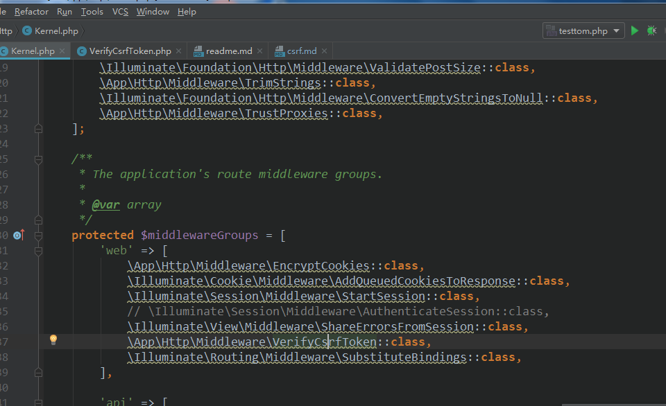
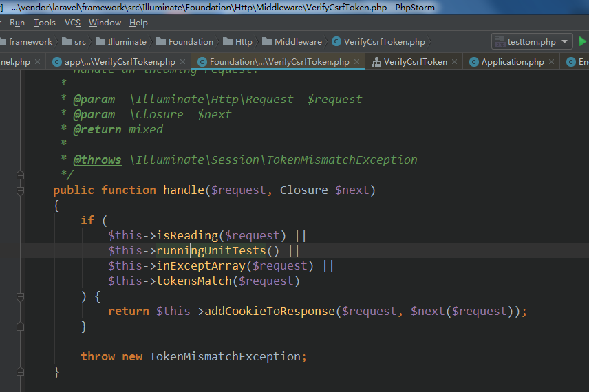
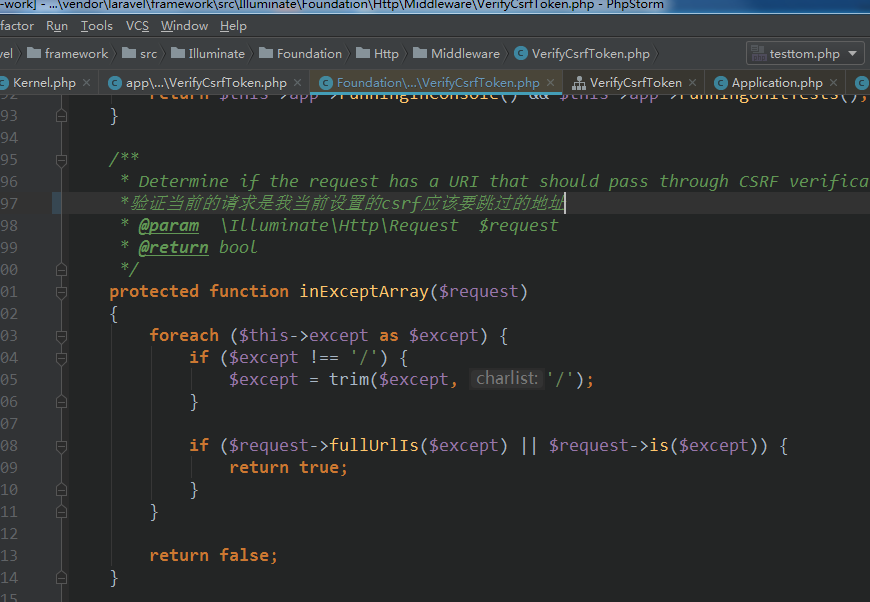
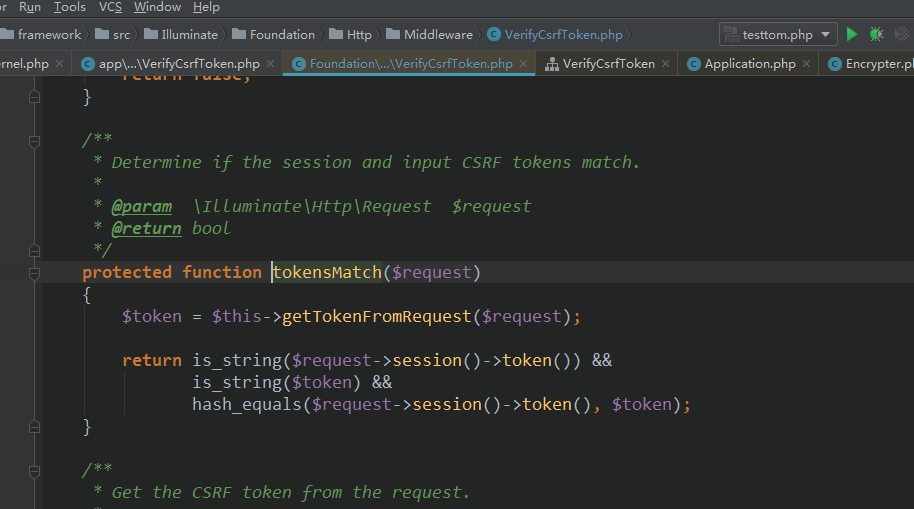
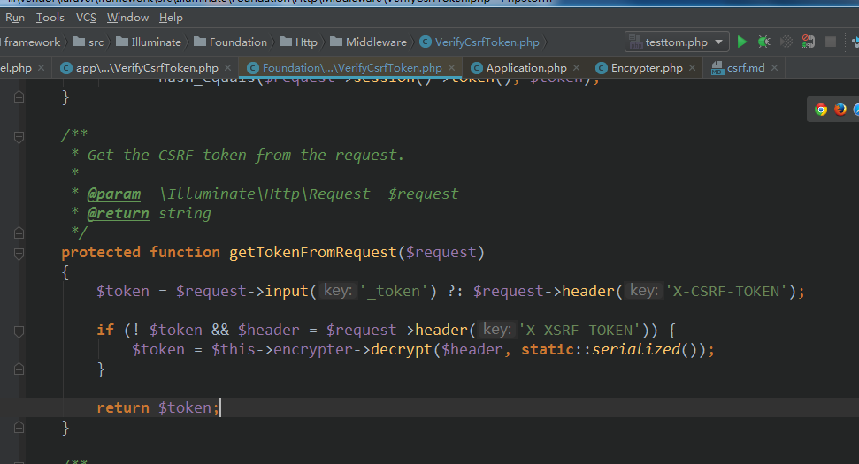
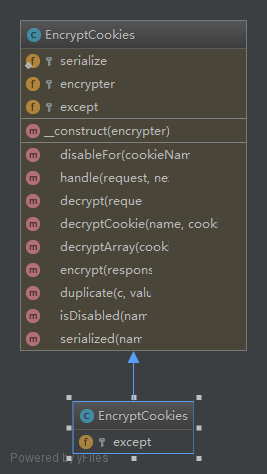
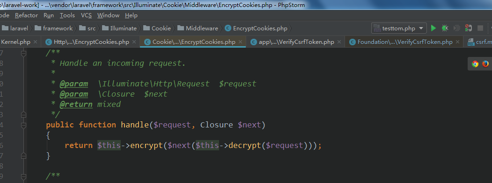
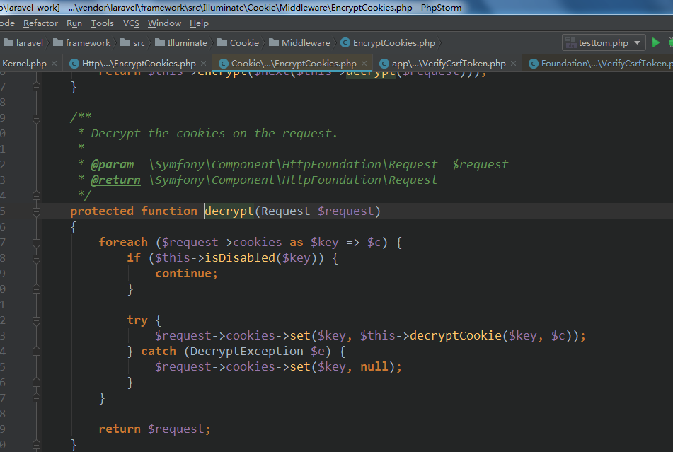

### csrf
- [CSRF laravel-china上的手册](https://learnku.com/docs/laravel/5.5/csrf/1295)  

- csrf 中间件  
中间件类会在框架启动的时候【就是一次http请求的时候】会运行所有的中间件类  
其中含有CSRF中间件  
  

CSRF中间件类结构图  
  

csrf handle   
  

expectArray 跳过指定的uri不进行csrf验证   
  

token匹配验证   
 

获取传递过来的token    
   

-EncryptCookies  中间件类的骚操作   
结构图   
  

handle 

解密cookie   
   

- Illuminate\Encryption\Encrypter 类说明  
[openssl加解密码手册](https://www.php.net/manual/en/function.openssl-encrypt.php)  
openssl加解密