### 数据库DB类注解说明
- DB是个伪装类  
 [db的使用文档](https://learnku.com/docs/laravel/5.5/database/1326#running-queries)
```php 
namespace Illuminate\Support\Facades;

/**
 * @see \Illuminate\Database\DatabaseManager
 * @see \Illuminate\Database\Connection
 */
class DB extends Facade
{
    /**
     * Get the registered name of the component.
     *
     * @return string
     */
    protected static function getFacadeAccessor()
    {
        return 'db';
    }
}

```   
这伪装框架在启动的时候早就注册过了，不在说明   
在调用DB时实际上是返回Illuminate\Database\DatabaseManager 实例对象  
在静态调用时触发如下流程【前面已经说过了】  
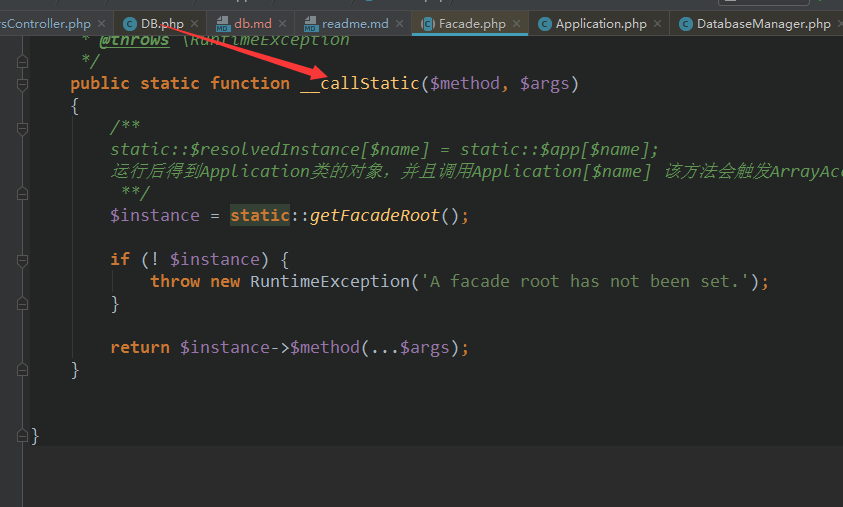   
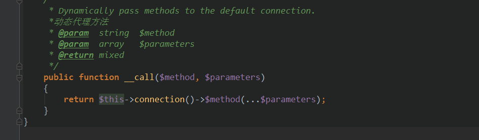   
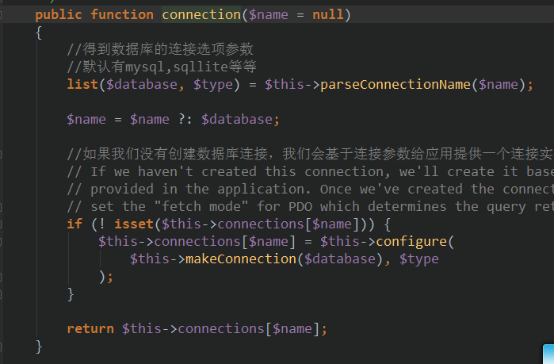   
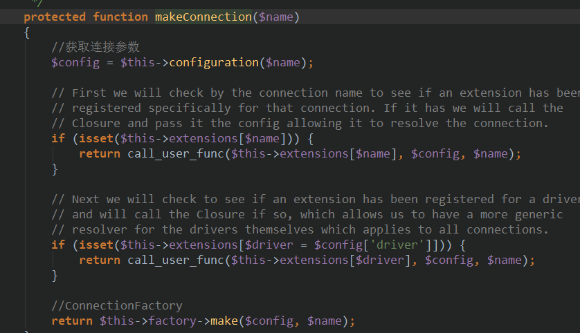   
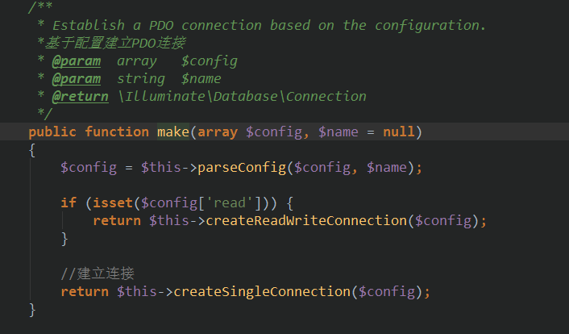   
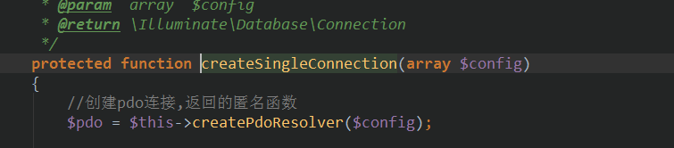   
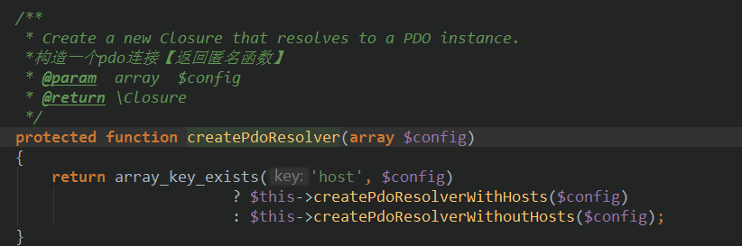   
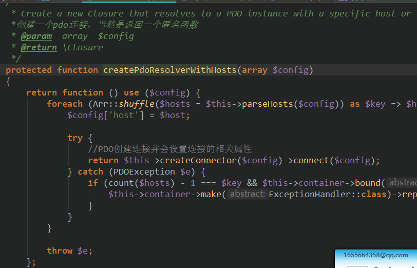   
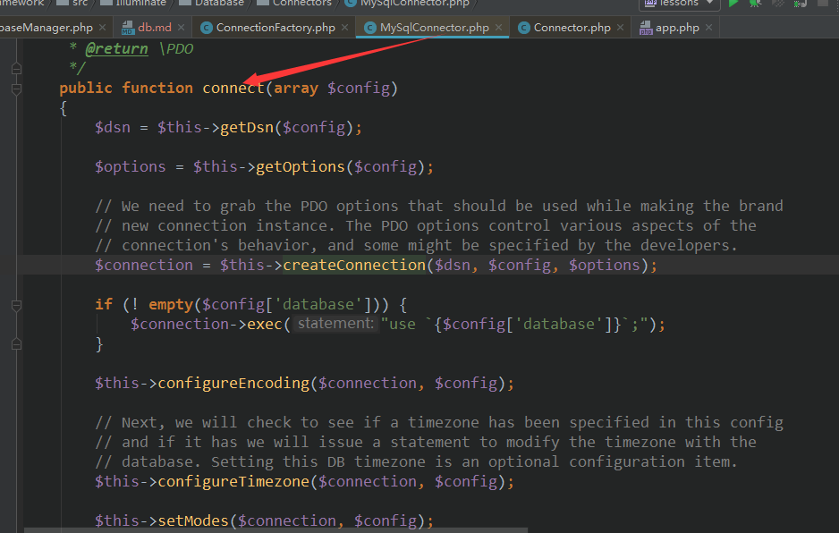   
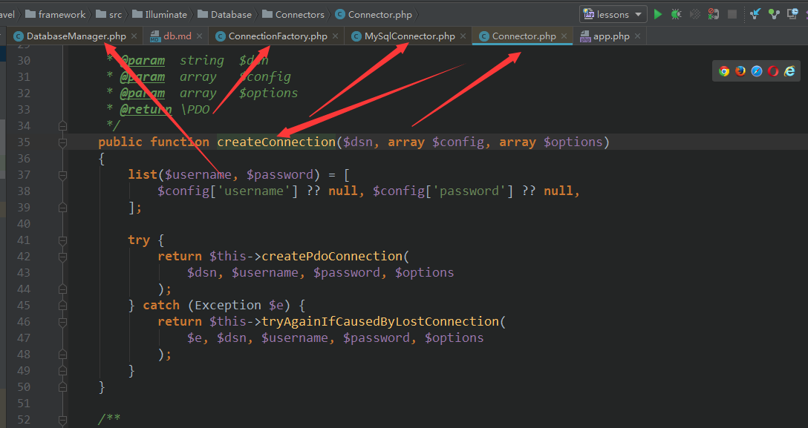   
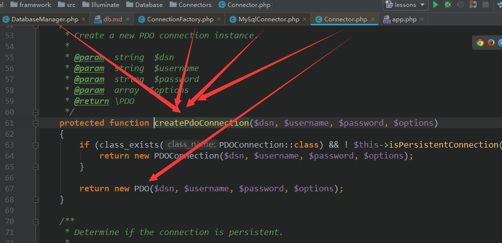  

经过层层运行，最终返回如下玩意  
 
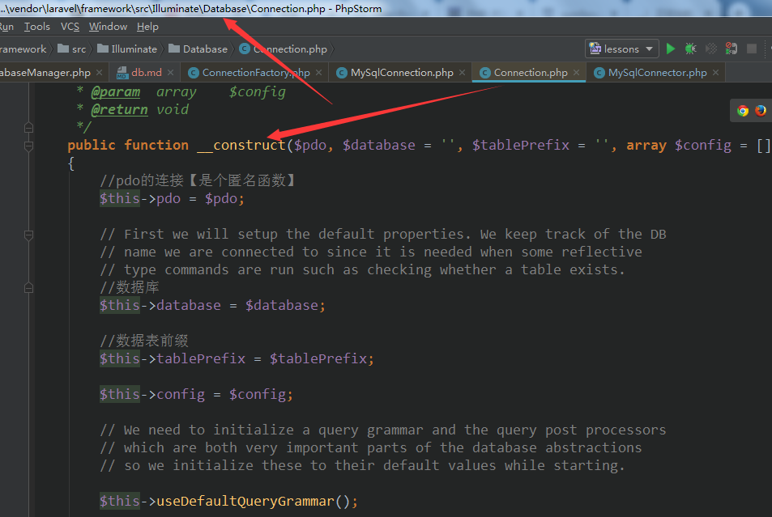  

插入数据动作  
 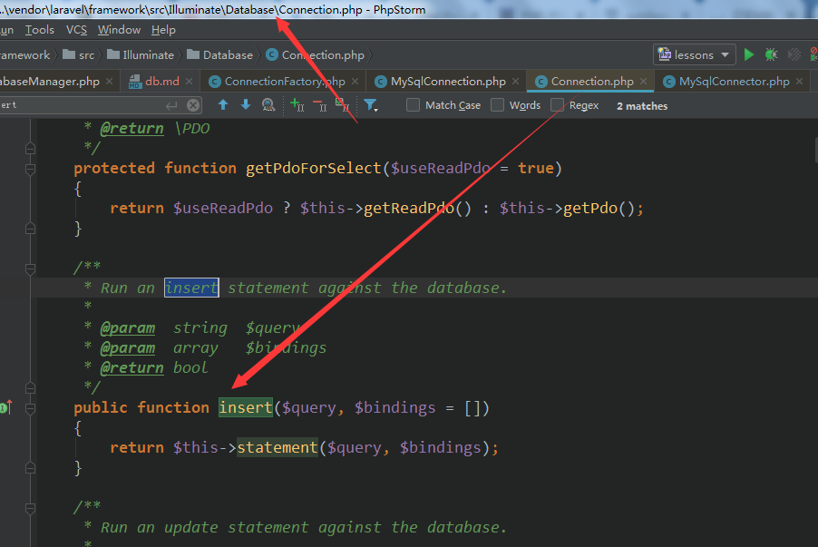 
 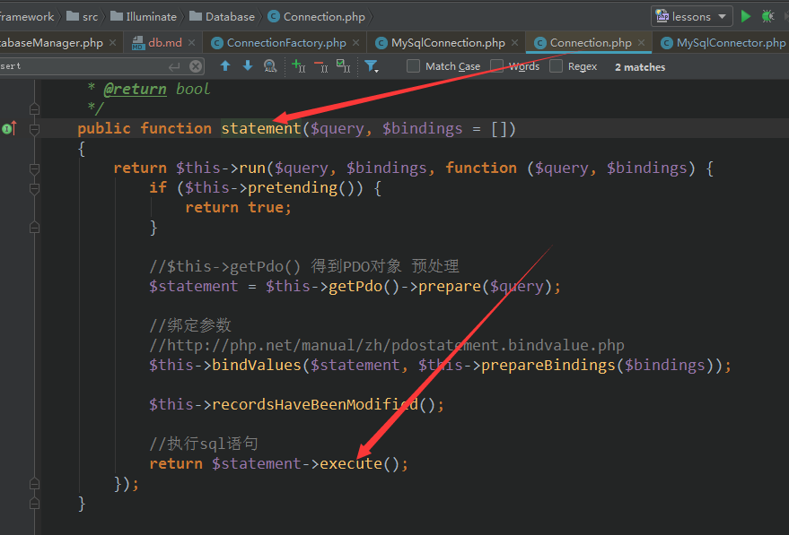 
 
 查询构造器  
 db::table()会返回\Illuminate\Database\Query\Builder  
 实例，以下是查询构造器的部分示例用法  
 
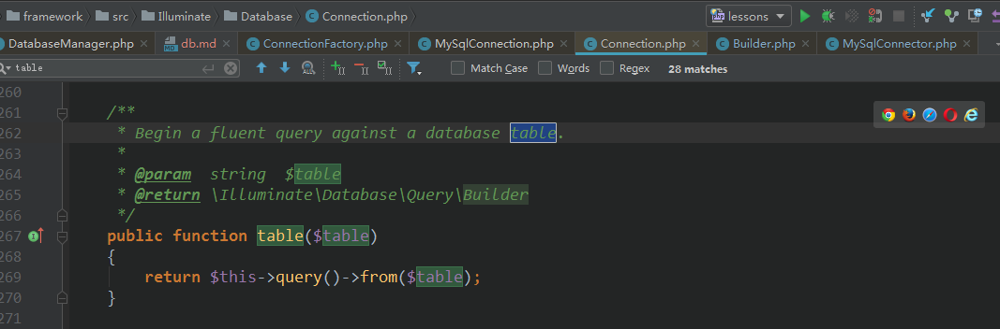 
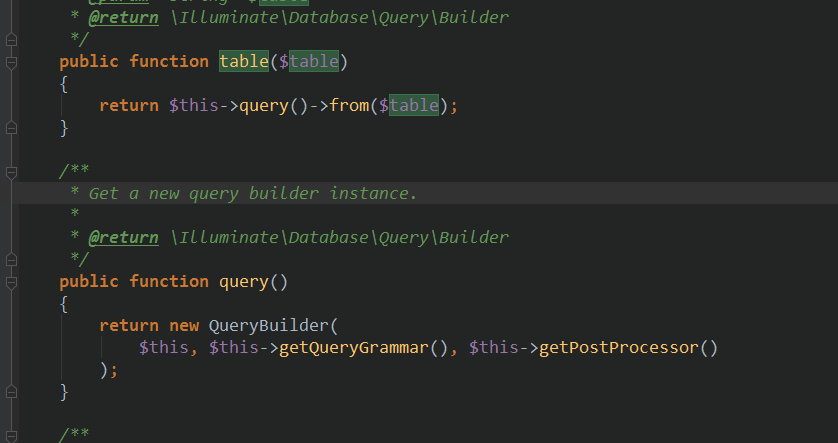 
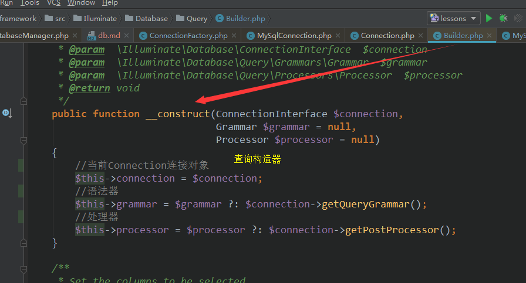 
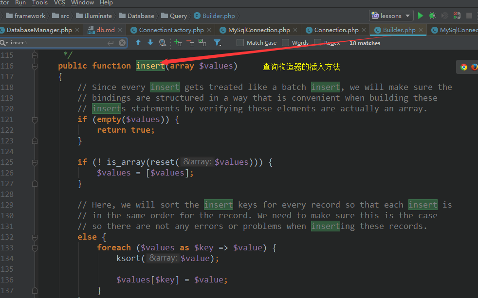 
   
查询构造器是基于\Illuminate\Database\Connection 连接器  
该类run的crud都是基于pdo层处理的


所以db::(crud)方法是基于连接\Illuminate\Database\Connection  
的，其内是基于pdo层处理    
db::table()->(xxx) 是基于\Illuminate\Database\Query\Builder查询构造器 
但构造构造器是基于连接，连接基于pdo层的   

具体关系如下   
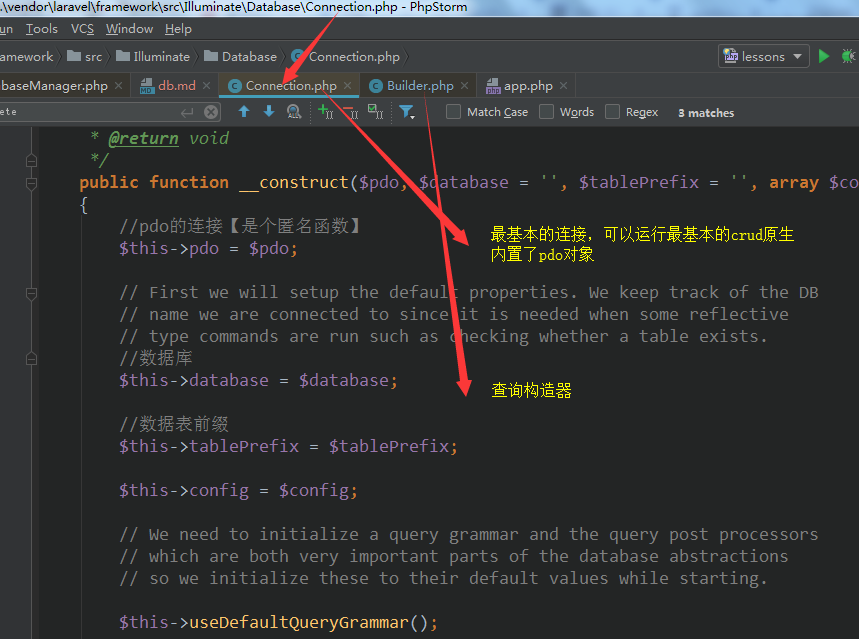  
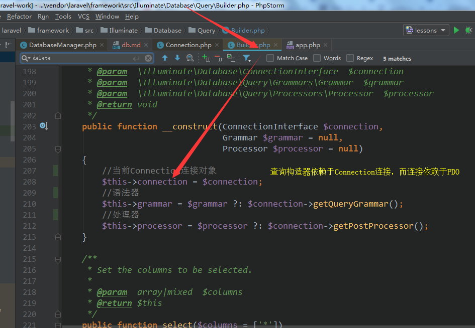  