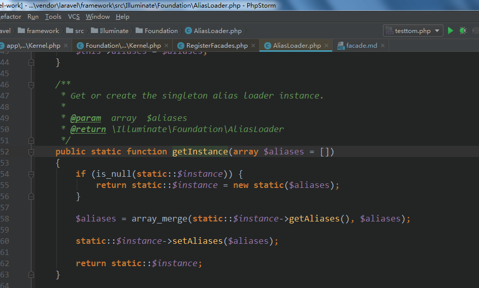
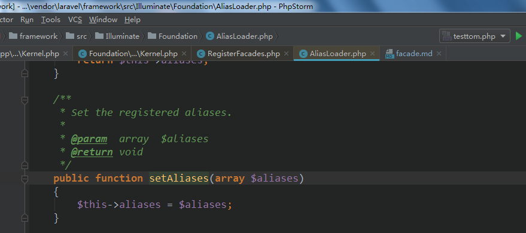
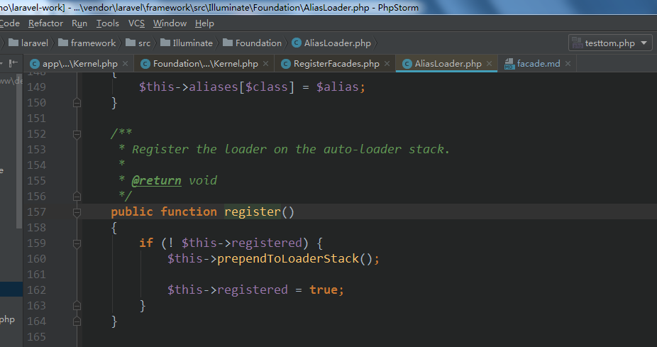
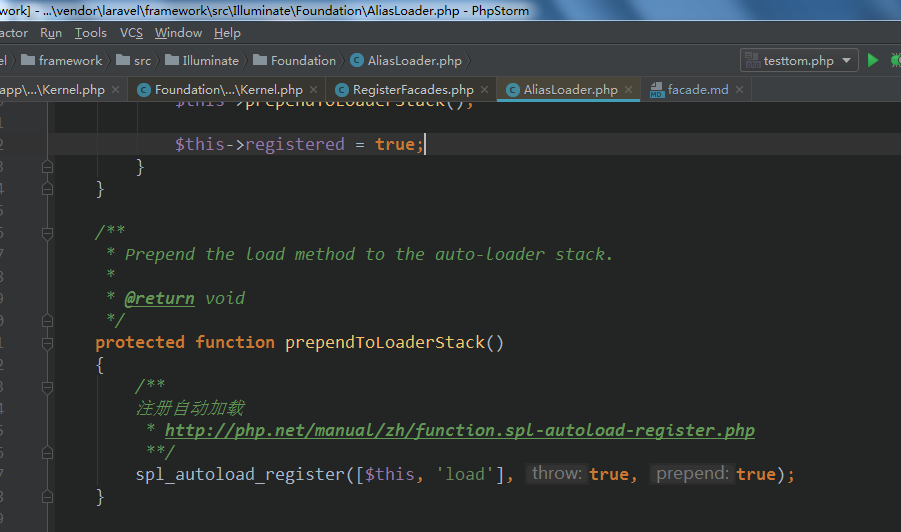
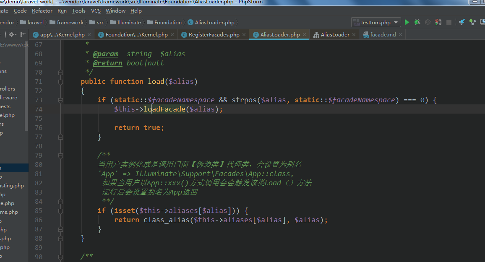
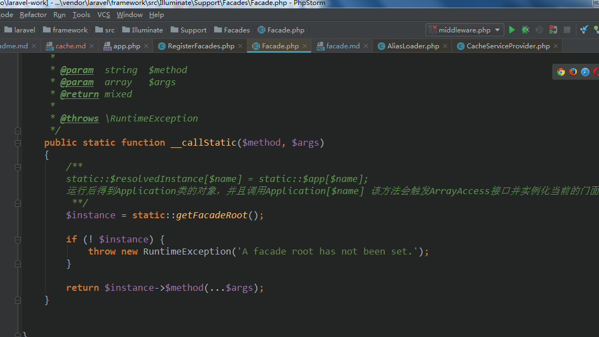
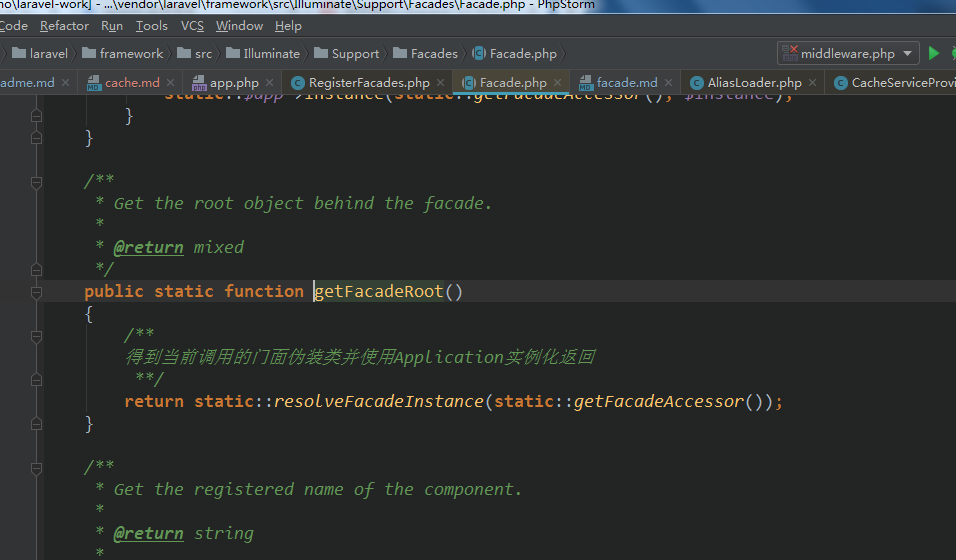
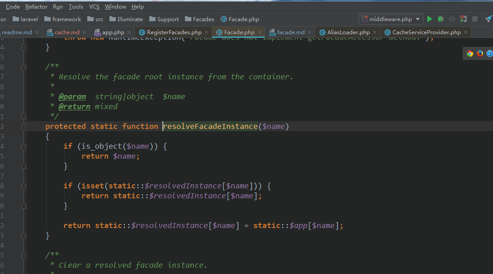

### Facade伪装 注册  
 - 注册  
 ```php  
 class RegisterFacades
 {
     /**
      * Bootstrap the given application.
      *
      * @param  \Illuminate\Contracts\Foundation\Application  $app
      * @return void
      */
     public function bootstrap(Application $app)
     {
         Facade::clearResolvedInstances();
 
         /**
 
         子门面类伪装具体的类
         门面基类保存Application类，用于实现实例化子门面类对应的具体类
          **/
         Facade::setFacadeApplication($app);
 
         AliasLoader::getInstance(array_merge(
             //得到配置文件app下类别名
             $app->make('config')->get('app.aliases', []),
             //得到缓存目录下的配置别名包即bootstrap/cache/packages.php
             $app->make(PackageManifest::class)->aliases()
         ))->register();
 
         /**
         将框架的所有门面【伪装类】配置文件里配置好的
         保存在$this->aliases[]数组里
         当调用门面【伪装类】会自动触发转换为其别名返回
          **/
     }
 }
 ```   
 加载流程  
 
 
 
 


[spl自动加载器的解释](http://php.net/manual/zh/function.spl-autoload-register.php)  
伪装类的加载会先在Composer的自动加载器运行之前先捕获到类  

类别名【伪装类】加载器结构  
   
 
伪装类的加载流程  
     
 
伪装类的实例化  


  

```php  
public static function getFacadeRoot()
    {
        /**
        得到当前调用的门面伪装类并使用Application实例化返回
         **/
        return static::resolveFacadeInstance(static::getFacadeAccessor());
    }

    /**
     * Get the registered name of the component.
     *
     * @return string
     *
     * @throws \RuntimeException
     */
    protected static function getFacadeAccessor()
    {
        throw new RuntimeException('Facade does not implement getFacadeAccessor method.');
    }

    /**
     * Resolve the facade root instance from the container.
     *
     * @param  string|object  $name
     * @return mixed
     */
    protected static function resolveFacadeInstance($name)
    {
        if (is_object($name)) {
            return $name;
        }

        if (isset(static::$resolvedInstance[$name])) {
            return static::$resolvedInstance[$name];
        }

        //$name 子伪装类重写返回如cache,auth,这些骚玩意  
        //这玩意将触发容器的拦截器【以数组形式访问那是它实现了ArrayAccess接口】 
        //具体怎么找到【可以看前面的容器注册那些玩意的流程】  
        //实例化
        return static::$resolvedInstance[$name] = static::$app[$name];
    }
```   


 
 