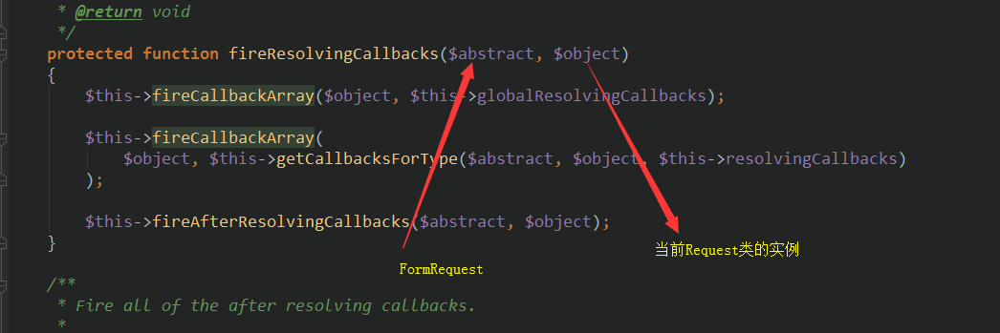
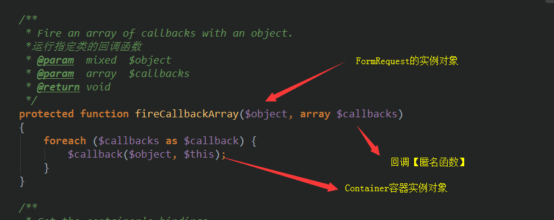
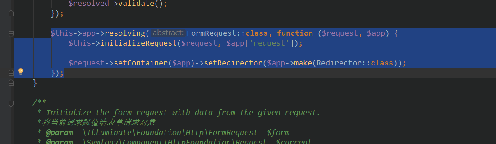
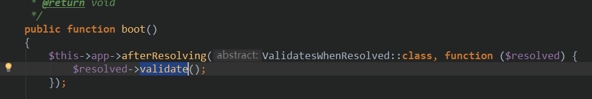
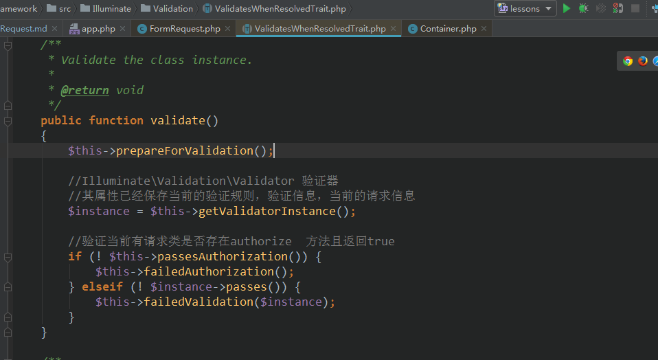
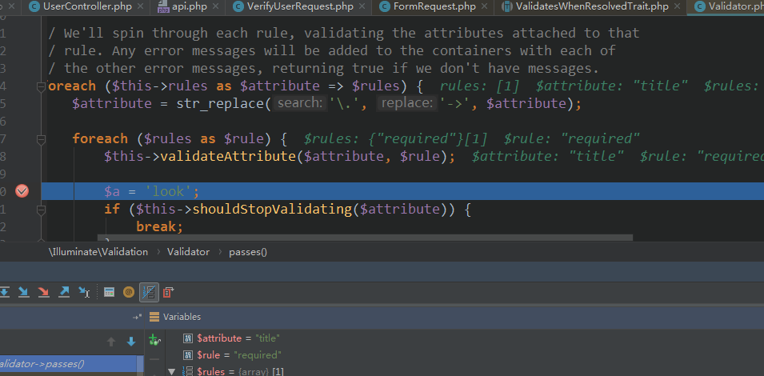
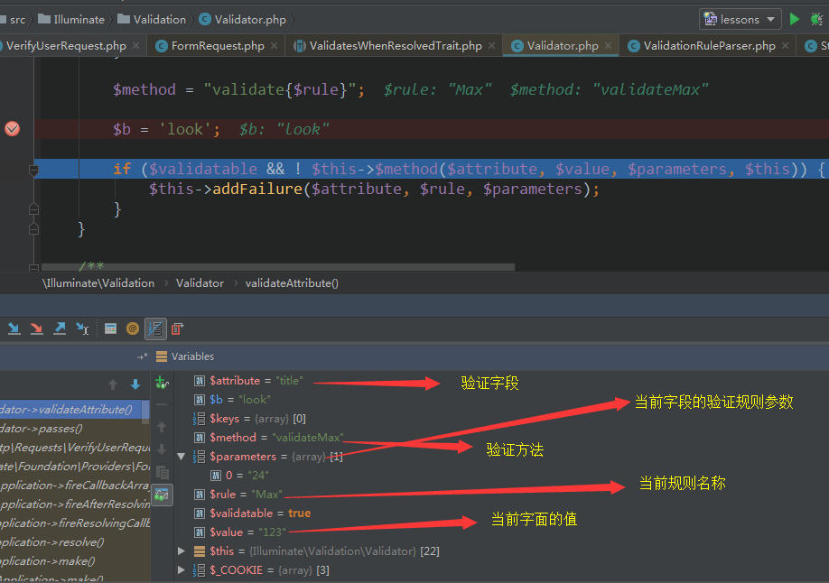

## laravel FormRequest 验证注解说明
#### FormRequestServiceProvider的运行过程
- 运行流程  


在这里注册的ValidatesWhenResolved,FormRequest 它们都是属于Request类
- 验证器的使用  


该验证器作为控制器的方法的参数controller->method(fromRequest)  时，在控制器调度时   
会进行反射【由Container类处理,[具体看控制器的依赖注入反射](../vendor/laravel/framework/src/Illuminate/Routing/ControllerDispatcher.php)】进行运行其方法  





然后运行如下代码  
  
调用验证方法validate  
  
  

- 验证器的验证  
```php 
protected function validateAttribute($attribute, $rule)
    {
        $this->currentRule = $rule;

        list($rule, $parameters) = ValidationRuleParser::parse($rule);

        if ($rule == '') {
            return;
        }

        // First we will get the correct keys for the given attribute in case the field is nested in
        // an array. Then we determine if the given rule accepts other field names as parameters.
        // If so, we will replace any asterisks found in the parameters with the correct keys.
        if (($keys = $this->getExplicitKeys($attribute)) &&
            $this->dependsOnOtherFields($rule)) {
            $parameters = $this->replaceAsterisksInParameters($parameters, $keys);
        }

        $value = $this->getValue($attribute);

        // If the attribute is a file, we will verify that the file upload was actually successful
        // and if it wasn't we will add a failure for the attribute. Files may not successfully
        // upload if they are too large based on PHP's settings so we will bail in this case.
        if ($value instanceof UploadedFile && ! $value->isValid() &&
            $this->hasRule($attribute, array_merge($this->fileRules, $this->implicitRules))
        ) {
            return $this->addFailure($attribute, 'uploaded', []);
        }

        // If we have made it this far we will make sure the attribute is validatable and if it is
        // we will call the validation method with the attribute. If a method returns false the
        // attribute is invalid and we will add a failure message for this failing attribute.
        $validatable = $this->isValidatable($rule, $attribute, $value);

        if ($rule instanceof RuleContract) {
            return $validatable
                    ? $this->validateUsingCustomRule($attribute, $value, $rule)
                    : null;
        }

        $method = "validate{$rule}";

        if ($validatable && ! $this->$method($attribute, $value, $parameters, $this)) {
            $this->addFailure($attribute, $rule, $parameters);
        }
    }
```   



[具体验证方法详情](../vendor/laravel/framework/src/Illuminate/Validation/Concerns/ValidatesAttributes.php)

