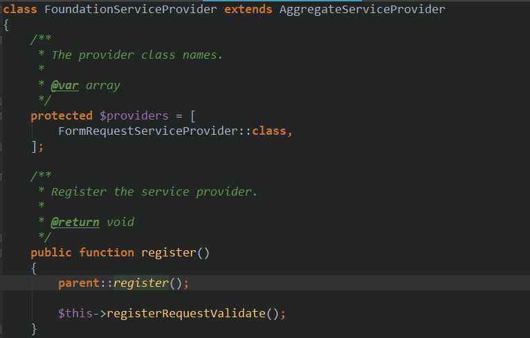
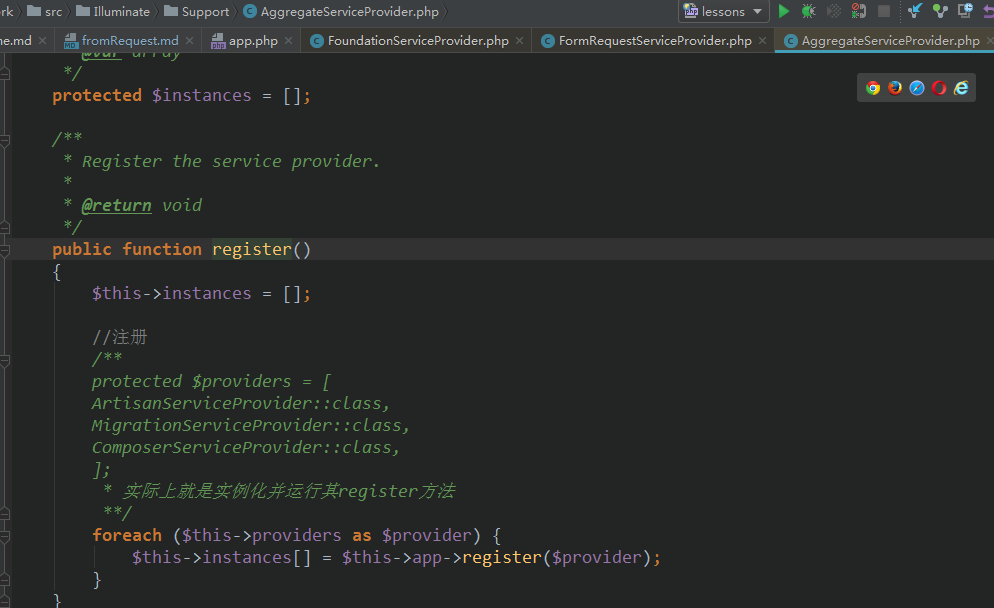
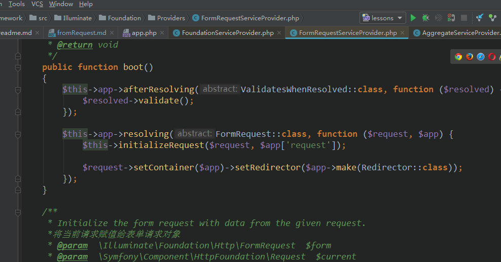
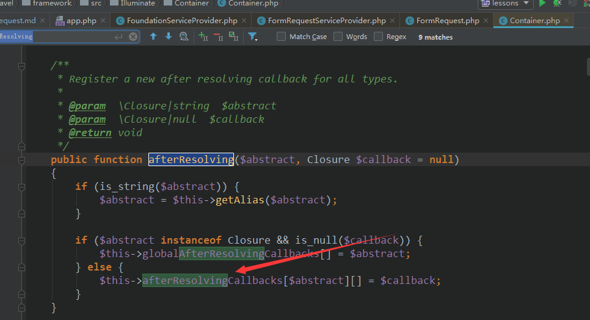
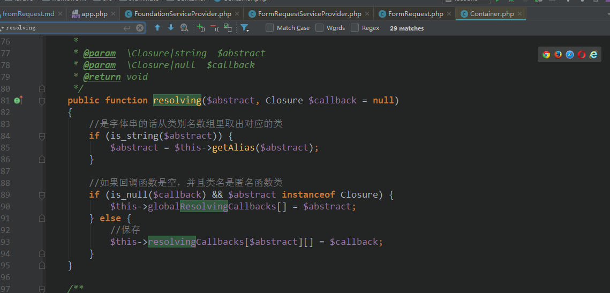
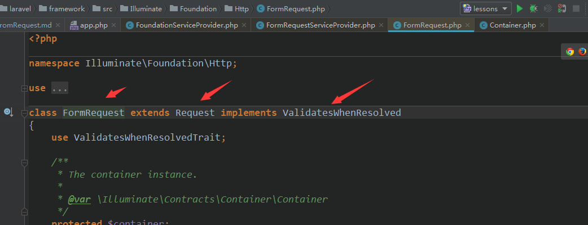
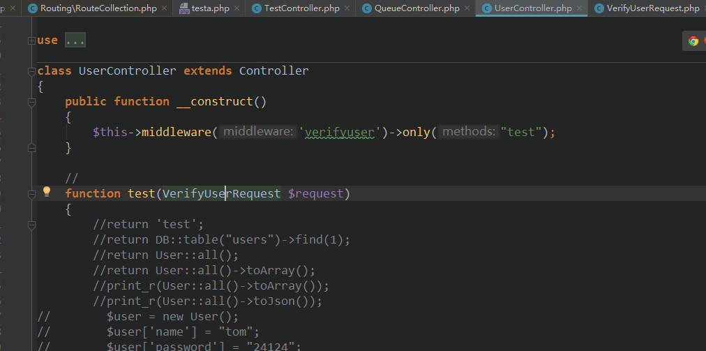
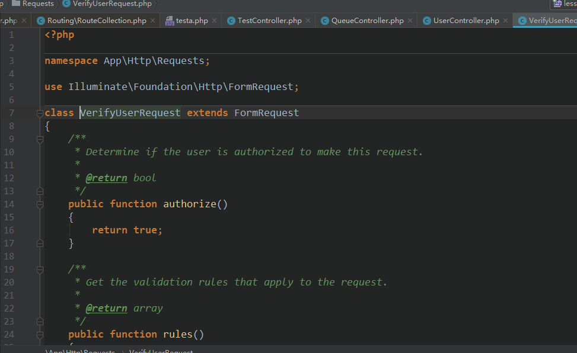
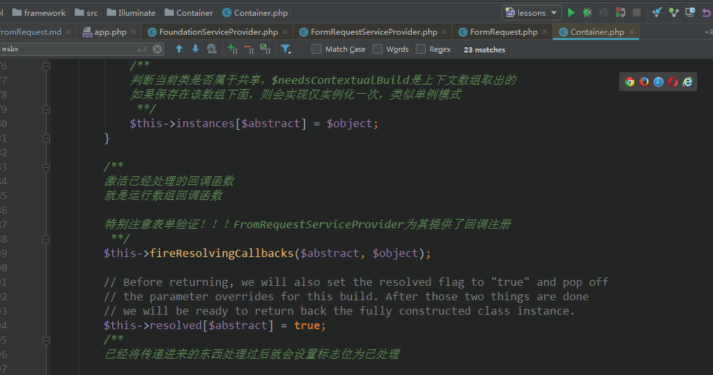

## laravel FormRequest 验证注解说明
#### FormRequestServiceProvider的运行过程
- 运行流程  

在这里注册的ValidatesWhenResolved,FormRequest 它们都是属于Request类
- 验证器的使用  

该验证器作为控制器的方法的参数controller->method(fromRequest)  时，在控制器调度时   
会进行反射【由Container类处理,[具体看控制器的依赖注入反射](../vendor/laravel/framework/src/Illuminate/Routing/ControllerDispatcher.php)】进行运行其方法  
