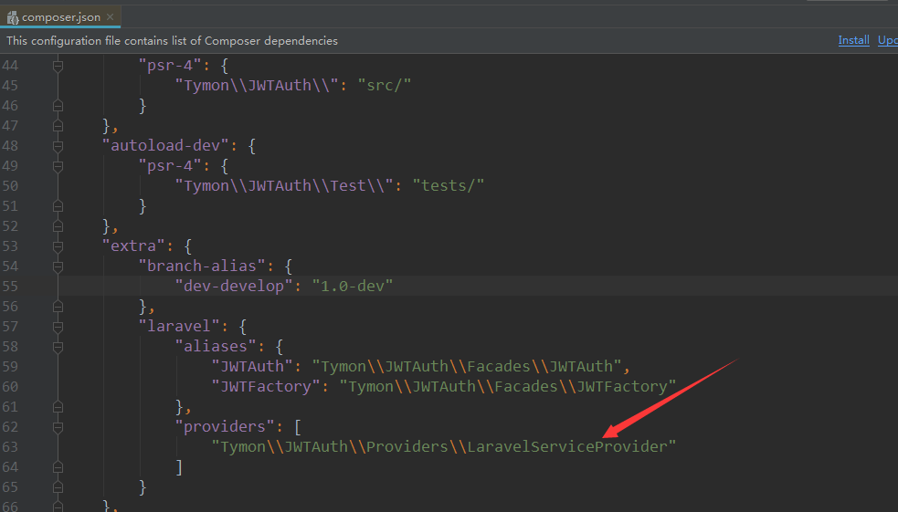

### jwt-auth注解  
- jwt composer file  
  
框架在启动的时候自然会运行此文件！
- jwt auth composer 包  
[jwt auth](https://packagist.org/packages/tymon/jwt-auth)  
- jwt auth 1.0.x版本  
[doc](https://jwt-auth.readthedocs.io/en/develop/)

- jwt auth laravel官网上的说明  
[laravel web jwt](https://learnku.com/articles/10885/full-use-of-jwt)

-jwt 详细说明 
[laravel 官网上的一位大神](https://learnku.com/articles/17883)  
