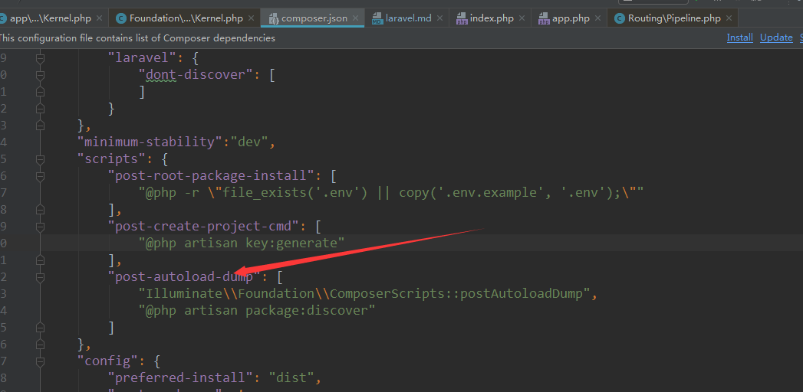

#laravel框架内核运行注解

### laravel扩展包安装时做了什么
1.composer事件
[composer事件](https://docs.phpcomposer.com/articles/scripts.html)
在运行composer命令时，会触发响应指定的事件，从而运行指定的脚本文件

2.laravel 的composer.json文件

3.每次安装第三方扩展时，会自动运行包发现指令，并读取vendor/composer/installed.json文件
里的内容，并将每个扩展包的extra额外选项下指定的laravel里的providers,alias下的配置获取
并写入指定的文件packages.php并保存在项目的bootstrap/cache/packages.php里
```php
$packages = [];

        if ($this->files->exists($path = $this->vendorPath.'/composer/installed.json')) {
            $packages = json_decode($this->files->get($path), true);
        }

        $ignoreAll = in_array('*', $ignore = $this->packagesToIgnore());

        $this->write(collect($packages)->mapWithKeys(function ($package) {
            return [$this->format($package['name']) => $package['extra']['laravel'] ?? []];
        })->each(function ($configuration) use (&$ignore) {
            $ignore = array_merge($ignore, $configuration['dont-discover'] ?? []);
        })->reject(function ($configuration, $package) use ($ignore, $ignoreAll) {
            return $ignoreAll || in_array($package, $ignore);
        })->filter()->all());
```

### laravel Illuminate\Foundation\Http\Kernel 内核大体流程
http 内核注册到实例化
```php
$app->singleton(
    /**
    运行后会将其以key,value形式保存在容器的bindings[]里
    我这里叫注册
     **/
    Illuminate\Contracts\Http\Kernel::class,
    App\Http\Kernel::class
);
 //从里面检索并实例化【反射】返回
$kernel = $app->make(Illuminate\Contracts\Http\Kernel::class);
```

http内核实例化时 路由添加中间件类
```php
public function __construct(Application $app, Router $router)
    {
        $this->app = $app;
        $this->router = $router;

        $router->middlewarePriority = $this->middlewarePriority;
        /**
        向路由类添加路由中间件类
        向路由类添加中间件类组
         **/
        foreach ($this->middlewareGroups as $key => $middleware) {
            $router->middlewareGroup($key, $middleware);
        }

        foreach ($this->routeMiddleware as $key => $middleware) {
            $router->aliasMiddleware($key, $middleware);
        }
    }
```
运行handle方法
```php 
 protected function sendRequestThroughRouter($request)
    {
        /**
        将当前的请求对象进行绑定，绑定到Application类的对象下
         **/
        $this->app->instance('request', $request);

        Facade::clearResolvedInstance('request');

        /**
        循环运行本类的成员$this->$bootstrappers[]下的成员数组
         **/
        $this->bootstrap();

        return (new Pipeline($this->app))
                    ->send($request) //加载全局中间件
                    ->through($this->app->shouldSkipMiddleware() ? [] : $this->middleware)
                    ->then($this->dispatchToRouter());

        /**
        $this->dispatchToRouter() 控制器运行之后返回的响应，响应由Symfony的组件完成
         **/
    }
```
此时当前请求相关的【request】已保存【注册】在窗口里的instances[request] = $request里了
`$this->bootstrap()`运行后
- 会完成环境配置文件的解析并将其保存在超级变量$_SERVER,$_ENV上
- 同时处理配置目录config/下的所有配置文件，并保存
- 设置错误，异常等自定义处理
- 注册自定义的伪装【他们叫门面？】
- 注册框架安装的所有扩展包【为laravel写的扩展包，有服务提供注册机制】并运行服务提供类的register方法
- 运行服务提供类的boot方法

### router 路由注册服务【路由服务类处理】
- 路由注册由 RouteServiceProvider 完成
- web路由注册代码
```php
Route::middleware('web')
             ->namespace($this->namespace)
             ->group(base_path('routes/web.php'));
```
`Route::middleware('web')` 此时将触发以下代码  
```php
Illuminate\Support\Facades\Facade

public static function __callStatic($method, $args)
    {
        /**
        static::$resolvedInstance[$name] = static::$app[$name];
        运行后得到Application类的对象，并且调用Application[$name] 该方法会触发ArrayAccess接口并实例化当前的门面子类如Route
         **/
        $instance = static::getFacadeRoot();

        /****/
        if (! $instance) {
            throw new RuntimeException('A facade root has not been set.');
        }

        return $instance->$method(...$args);
    }

public static function getFacadeRoot()
    {
        /**
        得到当前调用的门面伪装类并使用Application实例化返回
         **/
        return static::resolveFacadeInstance(static::getFacadeAccessor());
    }
protected static function getFacadeAccessor()
    {
        return 'router';
    }
    protected static function resolveFacadeInstance($name)
        {
            if (is_object($name)) {
                return $name;
            }
    
            if (isset(static::$resolvedInstance[$name])) {
                return static::$resolvedInstance[$name];
            }
    
            return static::$resolvedInstance[$name] = static::$app[$name];
        }
```


`static::$app[$name];`最终是容器从已经注册的池里检索到`'router'=> [\Illuminate\Routing\Router::class, \Illuminate\Contracts\Routing\Registrar::class, \Illuminate\Contracts\Routing\BindingRegistrar::class],
`Illuminate\Routing\Router::class类实例【反射】后返回

接着运行`Illuminate\Routing\Router->middleware('web')`激活魔术方法__call,从而运行如下代码  
```php 

public function __call($method, $parameters)
    {
        if (static::hasMacro($method)) {
            return $this->macroCall($method, $parameters);
        }

        /**
        Router类运行不存在的时候会运行到此
        当运行中间件方法时 $parameters=middle(web)传递过来的中间件别名参数

         当路由器调用：middleware,namesapce,domain,as时
         **/
        if ($method == 'middleware') {
            return (new RouteRegistrar($this))->attribute($method, is_array($parameters[0]) ? $parameters[0] : $parameters);
        }

        return (new RouteRegistrar($this))->attribute($method, $parameters[0]);
    }
```
此时是运行`new RouteRegistrar($this))`路由注册器,运行如下代码，保存路由属性
```php 
public function attribute($key, $value)
    {
        /**
        $key【可能是个方法method】
        判断不是本类规定的属性时
         **/
        if (! in_array($key, $this->allowedAttributes)) {
            throw new InvalidArgumentException("Attribute [{$key}] does not exist.");
        }

        //在此查看$this->>aliases[]和$this->>attributes[]数组
        //$this->attributes[middleware] = web;
        $this->attributes[Arr::get($this->aliases, $key, $key)] = $value;

        /**
        保存了中间件别名
        应用的命名空间
         **/
        $test = "show";
        return $this;
    }
```
   - 路由属性  
   
      | as | domain | middleware | name | namespace | prefix |
      |----|--------|------------|------|-----------|--------|
      | 别名| 域名   | 中间件     |  路由名称| 路由指向的空间 | 路由的前缀|
      


