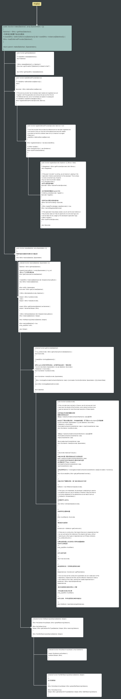
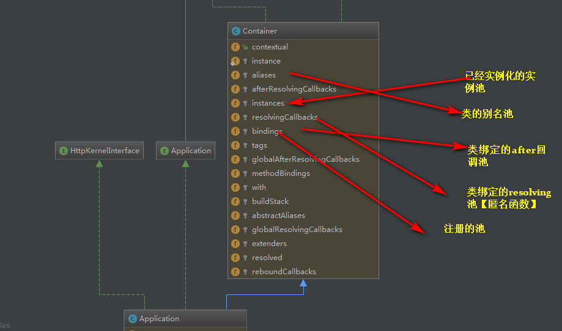
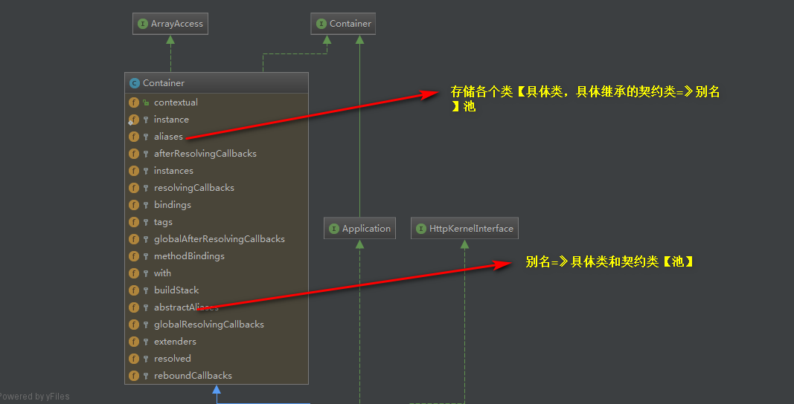

### Application make 方法的骚操作  
- Application的全局结构图【继承】
  

- make 方法全局流程图  
  

- make 大体流程说明  
根据abstract抽像类的值去检索alias别名池检索  
判断当前要实现化的对象是否是属于要延迟运行的服务提供类，是就会运行服务提供类的  
register,boot方法  
然后再运行，同样去检索已经实例化好的池instances池里检索是否有，没有就检索bindings  
池里的数据，获取到对应的值，判断是匿名函数就直接运行，是个类就反射返回,同时会   
运行绑定的after,resolving的匿名函数【回调池】  
    

//框架核心类的别名结构  
   

