### 数据库ORM注解说明
- [orm使用文档](https://learnku.com/docs/laravel/5.5/eloquent/1332)
- db的关系  
  Illuminate\Database\DatabaseManager----->Illuminate\Database\Connection(可以进行原生的sql)  
  操作------>pdo(原生的pdo了)   
  
  
  查询构造器
  db()->table()->xxx   
  这种操作呢关系如下   
  Illuminate\Database\Query\Builder------>Illuminate\Database\Connection----->pdo
  查询构造器的任何骚操作都是基于Connection的
  
- model  
  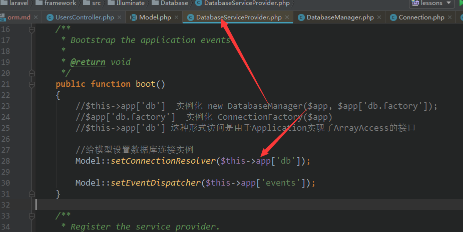
  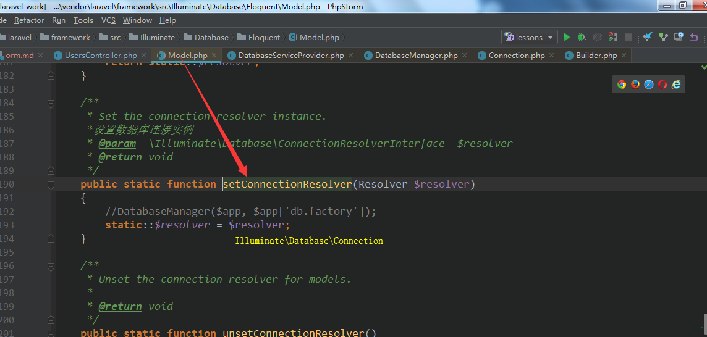
  
  静态使用  
   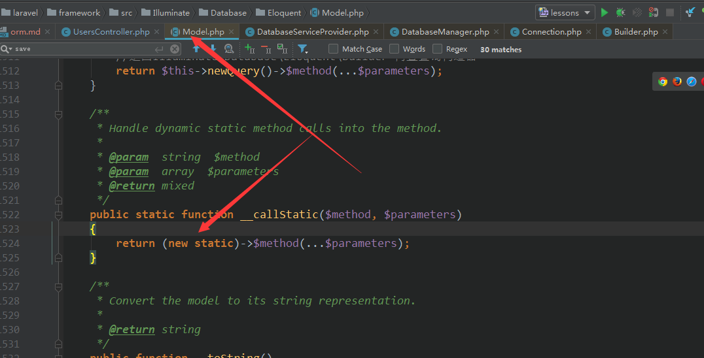  
   其实还是实例化的啦  
   ORM使用运行流程  
   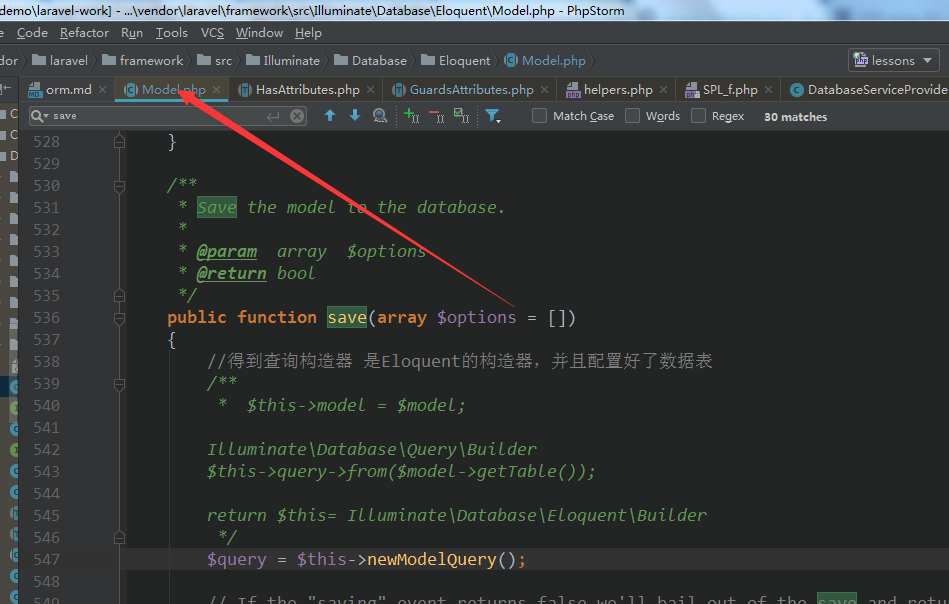  
   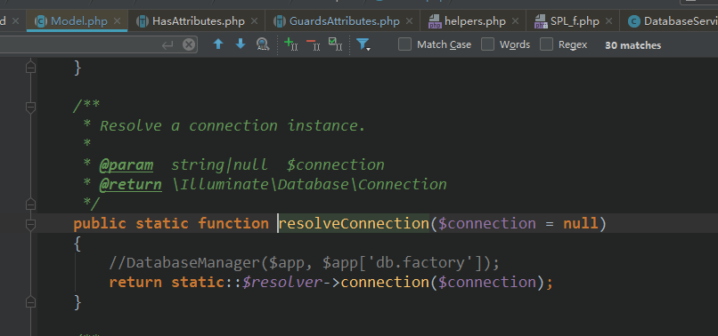  
   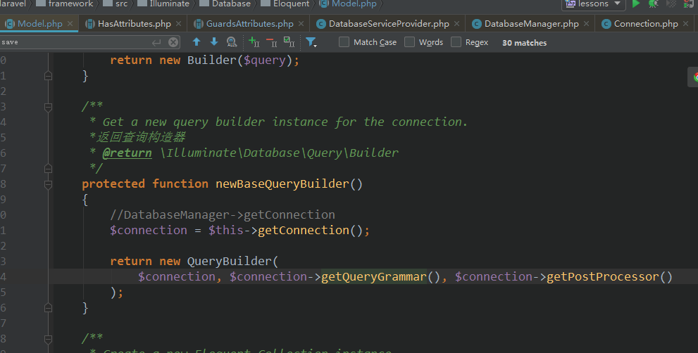  
   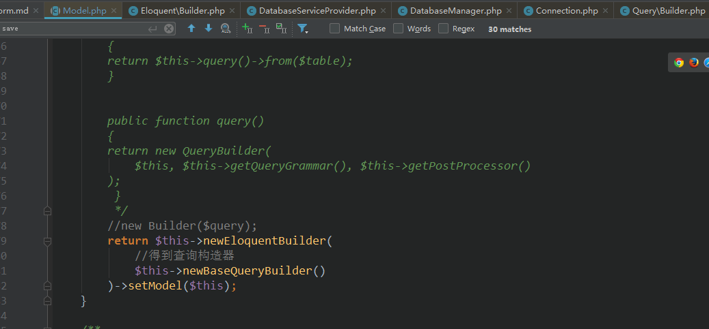  
   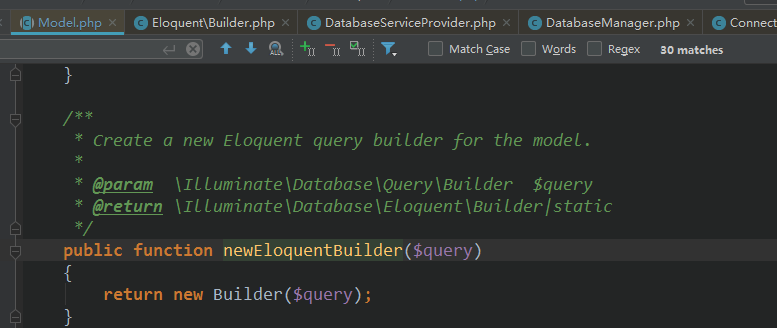  
   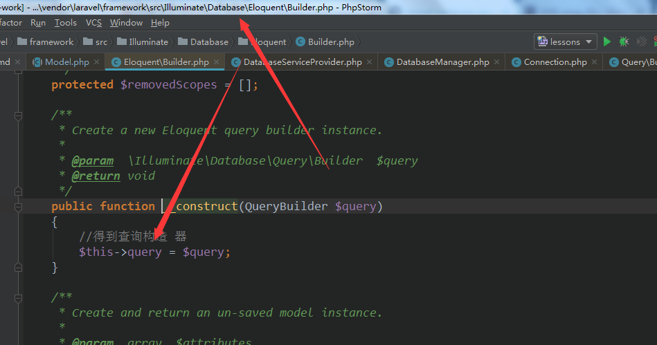  
   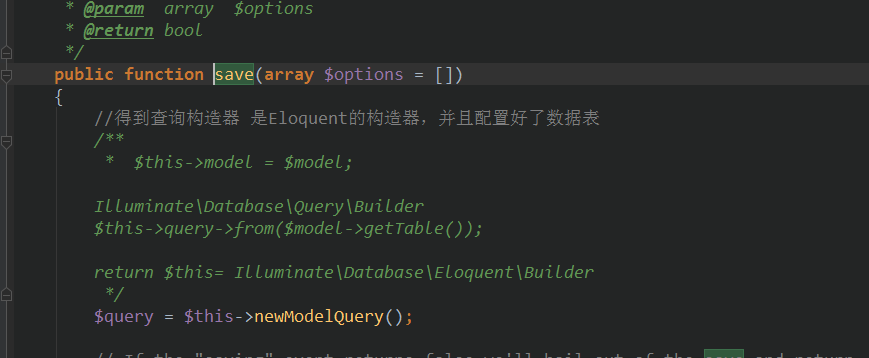  
  ` $query = $this->newModelQuery();` 本代码运行后返回Builder，关系如下  
  Illuminate\Database\Eloquent\Builder ---->Illuminate\Database\Query\Builder  
  --->Illuminate\Database\Connection ---->pdo  
   返回查询构造器 是Eloquent的构造器，并且配置好了数据表  
   比如一个插入数据操作  
   
   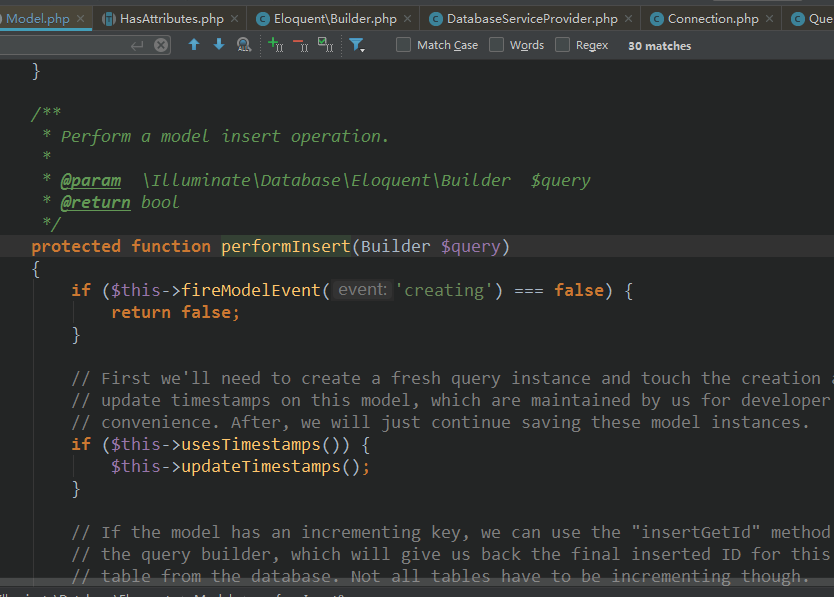  
   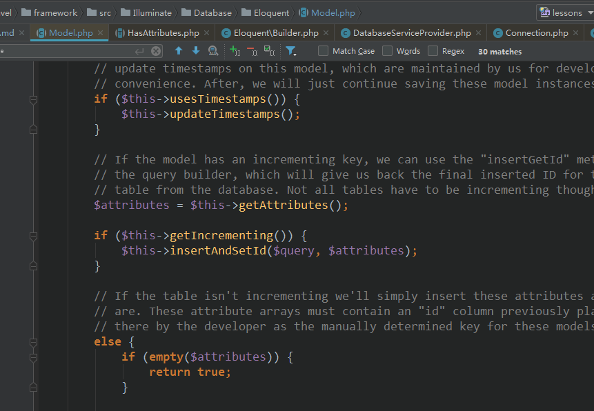  
   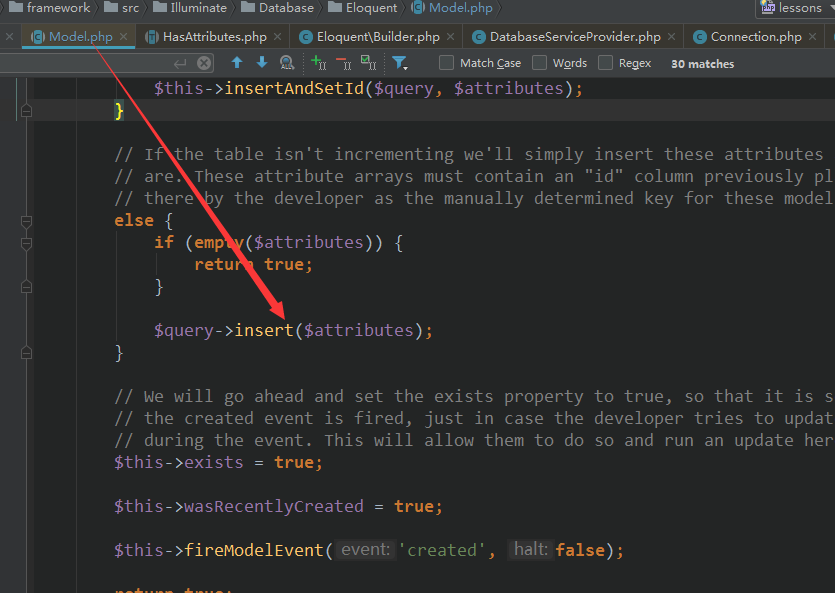  
   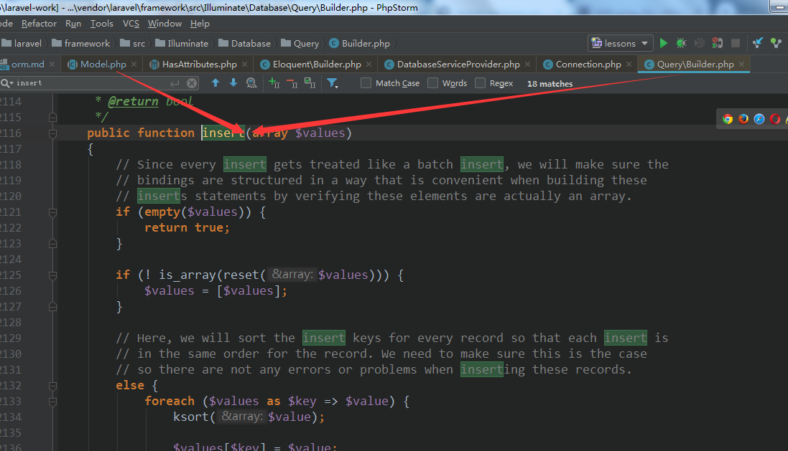  
   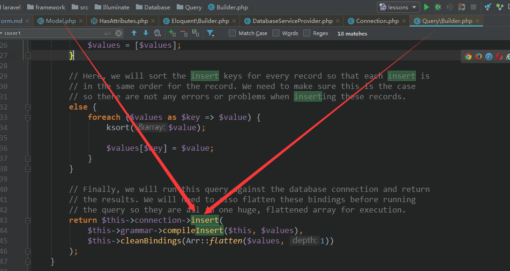  
   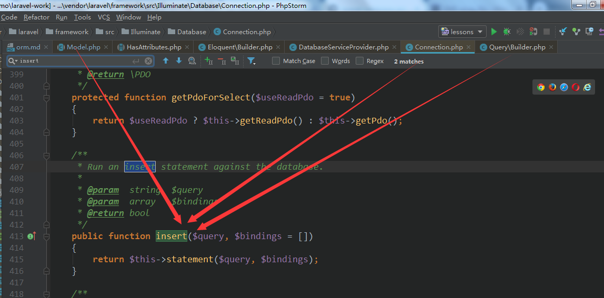  
   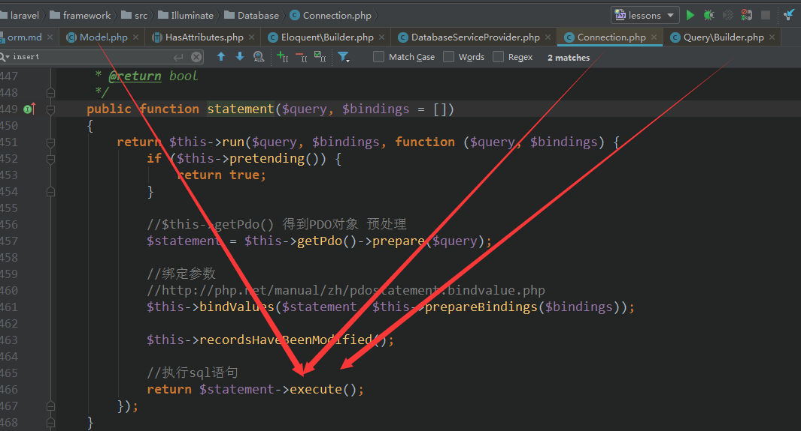   
   
   经过层层分析，Model是基于查询构造器(Illuminate\Database\Query\Builder -connection-pdo)运行的  
   插入操作
   
    
  使用Model当然可以调用基于查询构造器的方法   
  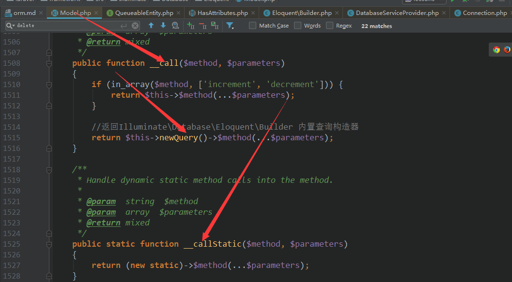 