## 队列系统注解  
[队列使用](https://learnku.com/docs/laravel/5.5/queues/1324)  

- 连接  
常用的redis,database都可以  

- 队列  
一个连接可有多个队列   

- 任务  
队列里的数据   


- make:job 任务创建   
```php 
 public function handle()
    {
        //$this->getNameInput() 得到命令参数如php artisan make:job xxx则得到xxx

        //得到任务类名
        $name = $this->qualifyClass($this->getNameInput());

        //拼接成xxx.php文件  得到任务类文件
        $path = $this->getPath($name);

        // First we will check to see if the class already exists. If it does, we don't want
        // to create the class and overwrite the user's code. So, we will bail out so the
        // code is untouched. Otherwise, we will continue generating this class' files.
        if ((! $this->hasOption('force') || ! $this->option('force')) && $this->alreadyExists($this->getNameInput())) {
            $this->error($this->type.' already exists!');

            return false;
        }

        // Next, we will generate the path to the location where this class' file should get
        // written. Then, we will build the class and make the proper replacements on the
        // stub files so that it gets the correctly formatted namespace and class name.
        //创建目录
        $this->makeDirectory($path);

        //往$this->files FileSystem文件系统类 】指定的文件里写数据【数据来自模板，模板已经替换好】
        $this->files->put($path, $this->buildClass($name));

        $this->info($this->type.' created successfully.');
    }

```   
根据输入的任务名称构建完整的任务类名和任务文件名，并读取任务模板替换生成任务类文件   

- 分发任务   
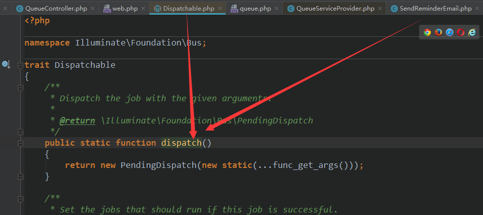   
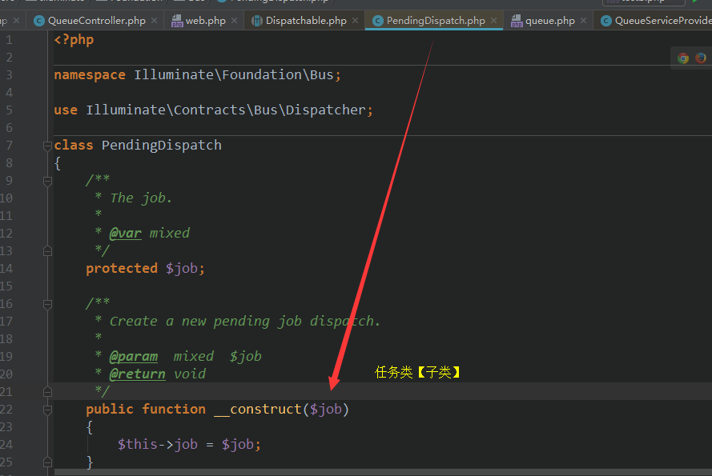      


分布任务的套路：   
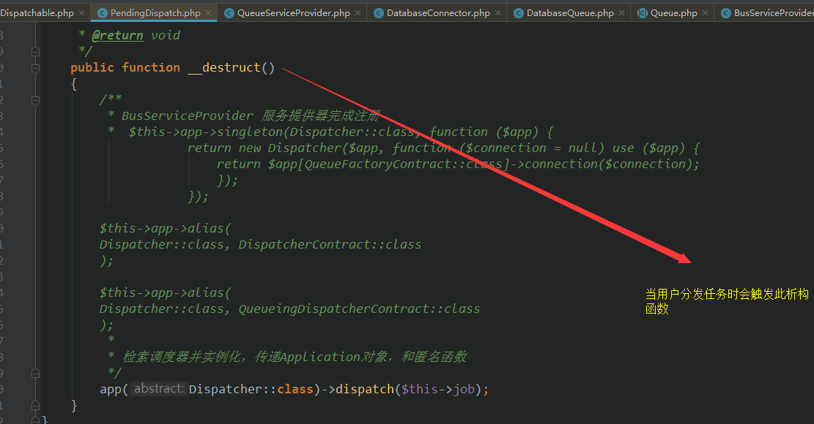    
Bus服务提供器已经注册如下玩意  
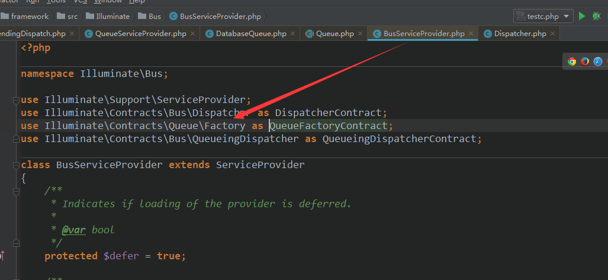  
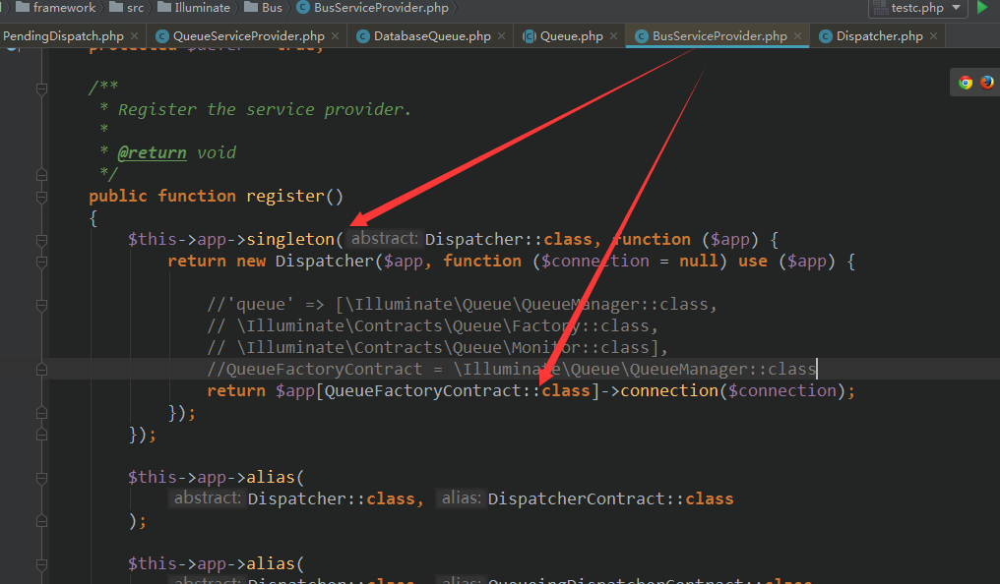    
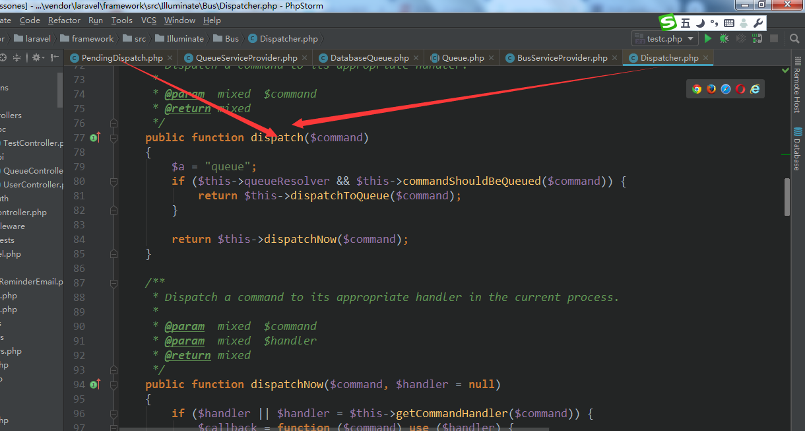    
  
开始实例化队列管理器  
   
```php 
$this->app->singleton(Dispatcher::class, function ($app) {
            return new Dispatcher($app, function ($connection = null) use ($app) {

                //'queue' => [\Illuminate\Queue\QueueManager::class,
                // \Illuminate\Contracts\Queue\Factory::class,
                // \Illuminate\Contracts\Queue\Monitor::class],
                //QueueFactoryContract = \Illuminate\Queue\QueueManager::class
                return $app[QueueFactoryContract::class]->connection($connection);
            });
        });
```   
当`$app[QueueFactoryContract::class]->connection($connection)` 这句代码运行后将   
从Application容器里找到queue,从而触发以下代码   
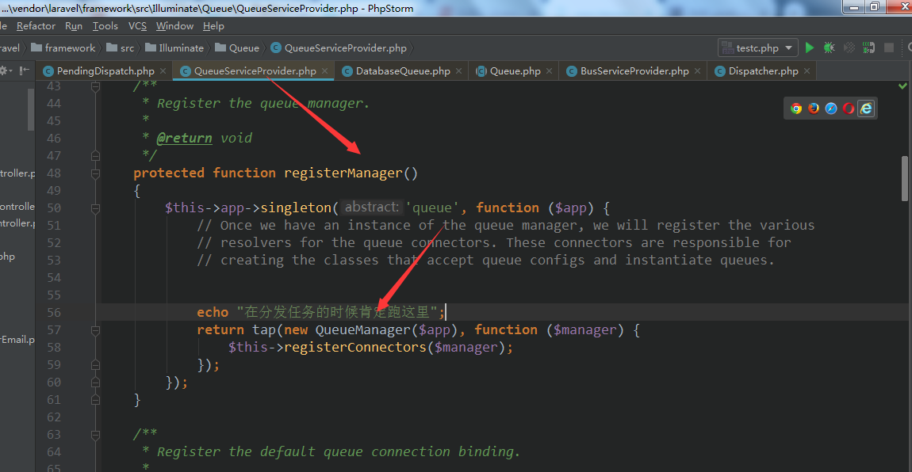  然后往QueueManager添加各种类型的队列  
连接器  
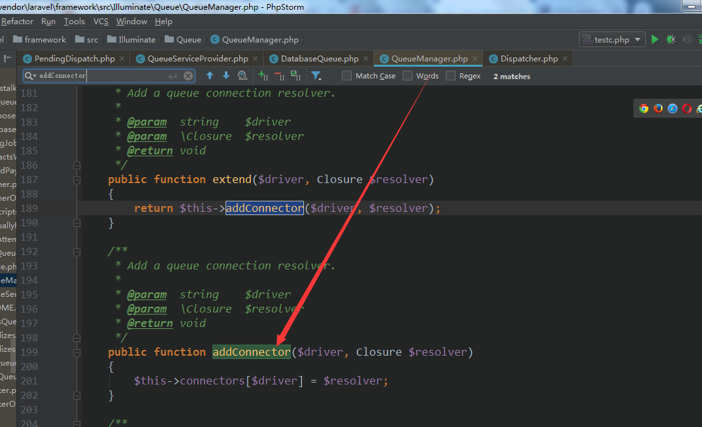   
队列管理器connection之后，会根据$connection取得对应的队列连接器   

队列管理器   
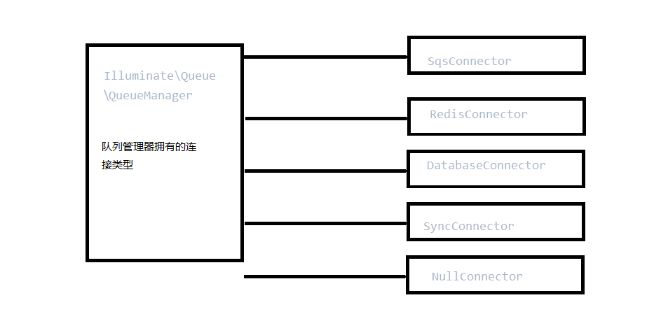  

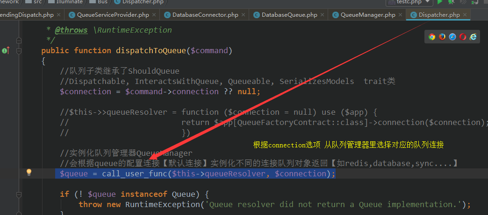   

`$this->pushCommandToQueue($queue, $command);` 
$queue 队列连接
$command 任务实例  


往连接【某个队列】里添加任务  

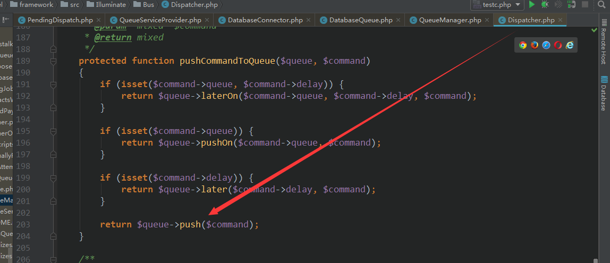 
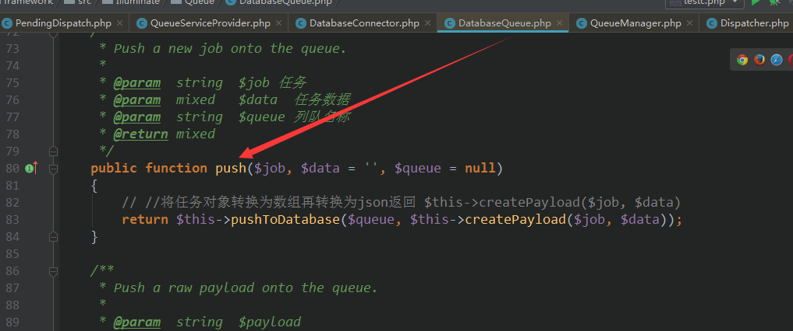    

任务体结构：最终会json_encode处理    
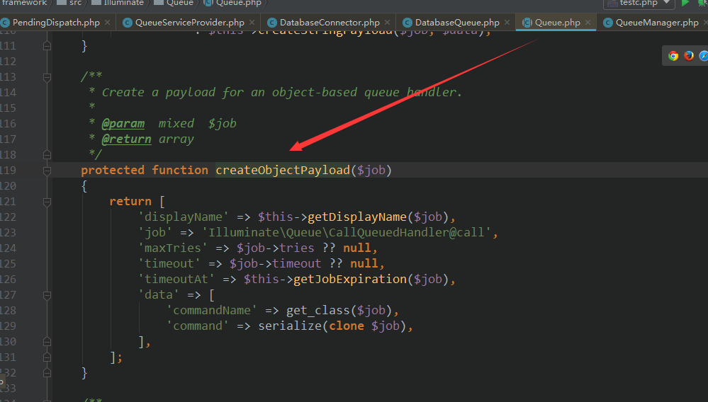   

任务入库保存  
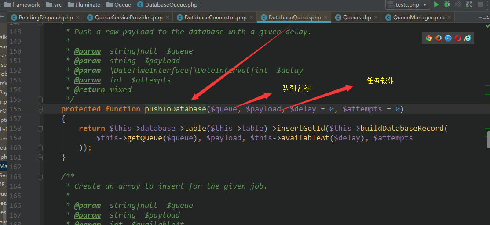 

- 运行任务   
queue:work   

```php 
Illuminate\Queue\Console\WorkCommand
public function handle()
    {
        if ($this->downForMaintenance() && $this->option('once')) {
            return $this->worker->sleep($this->option('sleep'));
        }

        // We'll listen to the processed and failed events so we can write information
        // to the console as jobs are processed, which will let the developer watch
        // which jobs are coming through a queue and be informed on its progress.
        $this->listenForEvents();

        //获取队列的连接选项参数
        $connection = $this->argument('connection')
                        ?: $this->laravel['config']['queue.default'];

        // We need to get the right queue for the connection which is set in the queue
        // configuration file for the application. We will pull it based on the set
        // connection being run for the queue operation currently being executed.
        //获取连接的队列【默认是default】
        $queue = $this->getQueue($connection);

        $this->runWorker(
            $connection, $queue
        );
    }
```   
   
Illuminate\Queue\Worker
```php
 
  public function daemon($connectionName, $queue, WorkerOptions $options)
    {
        //进程信号监听
        $this->listenForSignals();

        $lastRestart = $this->getTimestampOfLastQueueRestart();

        while (true) {
            // Before reserving any jobs, we will make sure this queue is not paused and
            // if it is we will just pause this worker for a given amount of time and
            // make sure we do not need to kill this worker process off completely.
            if (! $this->daemonShouldRun($options, $connectionName, $queue)) {
                $this->pauseWorker($options, $lastRestart);

                continue;
            }

            //从队列连接对象取出任务对象
            // First, we will attempt to get the next job off of the queue. We will also
            // register the timeout handler and reset the alarm for this job so it is
            // not stuck in a frozen state forever. Then, we can fire off this job.
            $job = $this->getNextJob(
                $this->manager->connection($connectionName), $queue
            );

            $this->registerTimeoutHandler($job, $options);

            // If the daemon should run (not in maintenance mode, etc.), then we can run
            // fire off this job for processing. Otherwise, we will need to sleep the
            // worker so no more jobs are processed until they should be processed.
            if ($job) {
                $this->runJob($job, $connectionName, $options);
            } else {
                $this->sleep($options->sleep);
            }

            // Finally, we will check to see if we have exceeded our memory limits or if
            // the queue should restart based on other indications. If so, we'll stop
            // this worker and let whatever is "monitoring" it restart the process.
            $this->stopIfNecessary($options, $lastRestart);
        }
    }
 ```   
 `//进程信号监听
          $this->listenForSignals();`  
             
          ```php 
          protected function listenForSignals()
              {
                  if ($this->supportsAsyncSignals()) {
                      pcntl_async_signals(true);
          
                      //程序结束时
                      pcntl_signal(SIGTERM, function () {
                          $this->shouldQuit = true;
                      });
          
                      //进程退出信号
                      pcntl_signal(SIGUSR2, function () {
                          $this->paused = true;
                      });
          
                      pcntl_signal(SIGCONT, function () {
                          $this->paused = false;
                      });
                  }
              }
          ```

[php进程管理](http://php.net/manual/en/function.pcntl-signal.php)   
[进程信号列表](https://blog.csdn.net/tennysonsky/article/details/46010505)   

next   
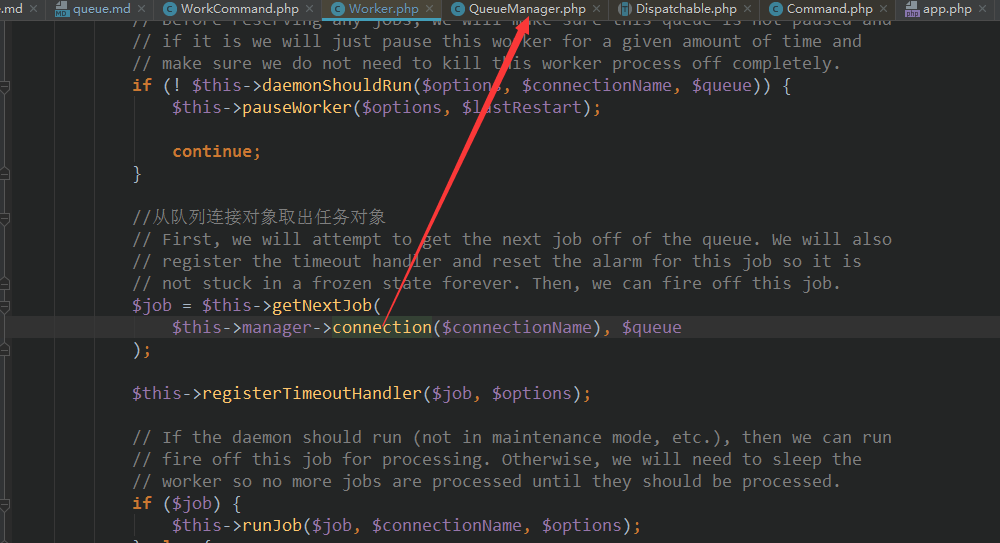  
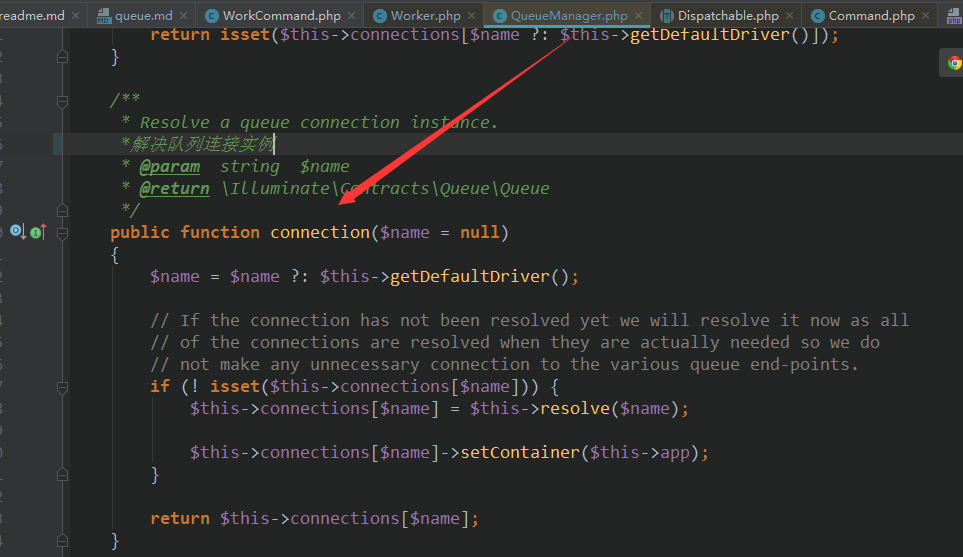  
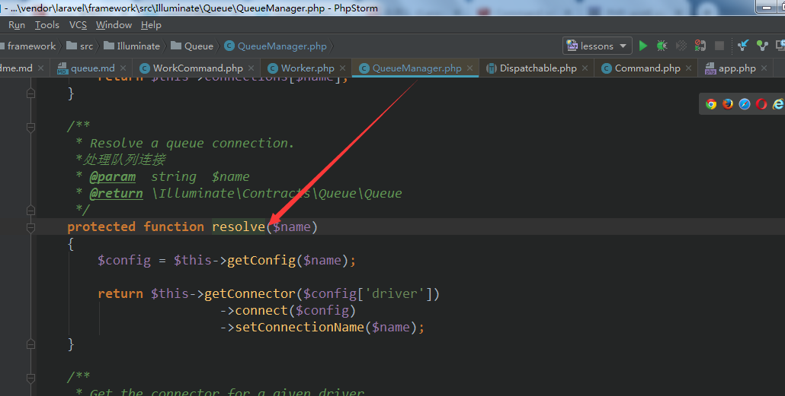    

如果配置文件指定的默认连接是数据库或是php artisan queue:work --connection=数据库时   

  
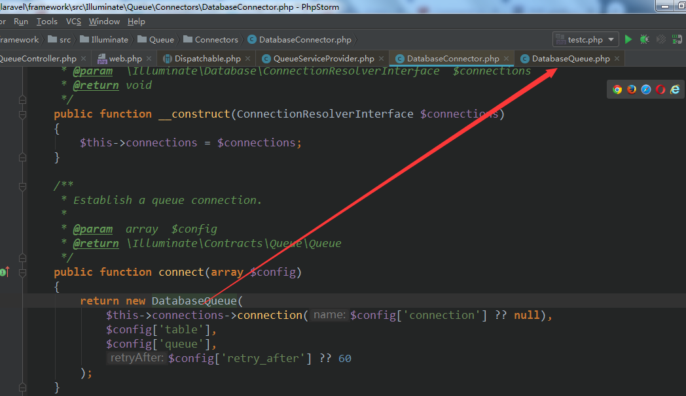  
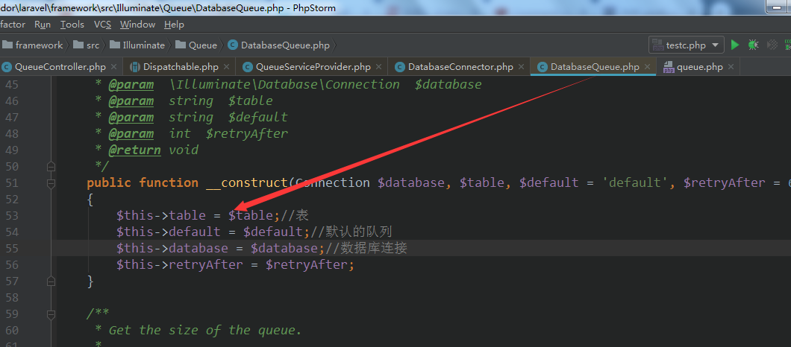  