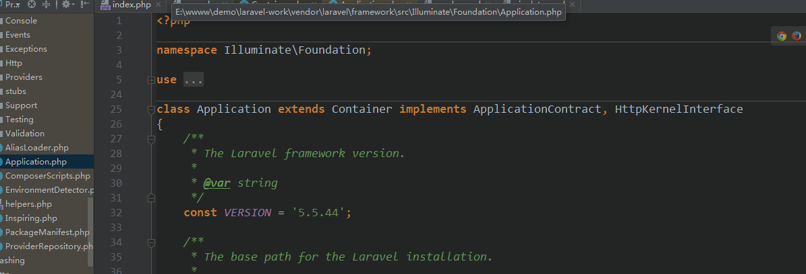

### Application singleton 方法的骚操作
- Application的继承  
```php 
namespace Illuminate\Foundation;
class Application extends Container implements ApplicationContract, HttpKernelInterface
class Container implements ArrayAccess, ContainerContract
```     
[php ArrayAccess接口文档](https://www.php.net/manual/en/class.arrayaccess.php)  
Application的继承关系图   


图片  
