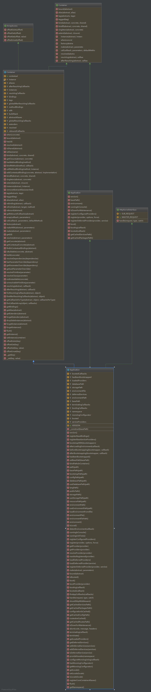
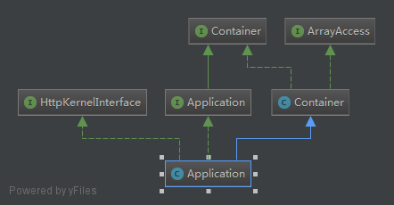
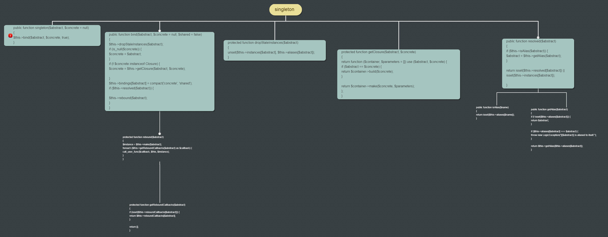
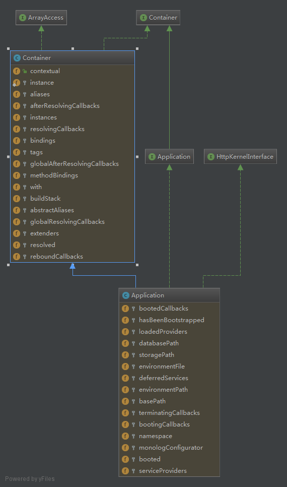

### Application singleton 方法的骚操作
- Application的继承  
```php 
namespace Illuminate\Foundation;
class Application extends Container implements ApplicationContract, HttpKernelInterface
class Container implements ArrayAccess, ContainerContract
```     
[php ArrayAccess接口文档](https://www.php.net/manual/en/class.arrayaccess.php)  
Application的继承关系图   




- singleton 方法  
  

本方法大体功能：  
将抽像类名称(abstruct)，具体类名称(concrete)以key,value形式保存[注册]在成员bindings池里  
同时，还会根据当前传统的抽像类名去reboundCallbacks里检索一些匿名函数并运行   

Application容器下的成员属性【字段结构】  
